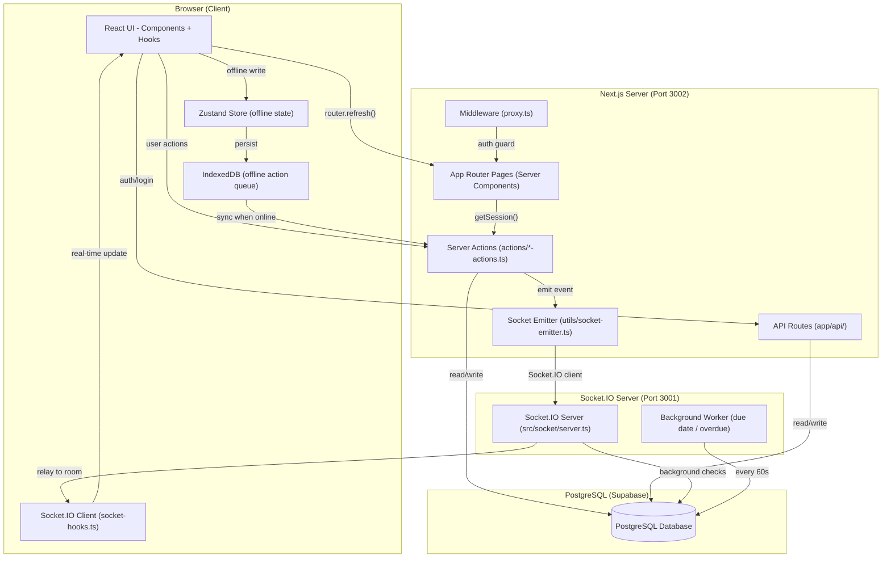
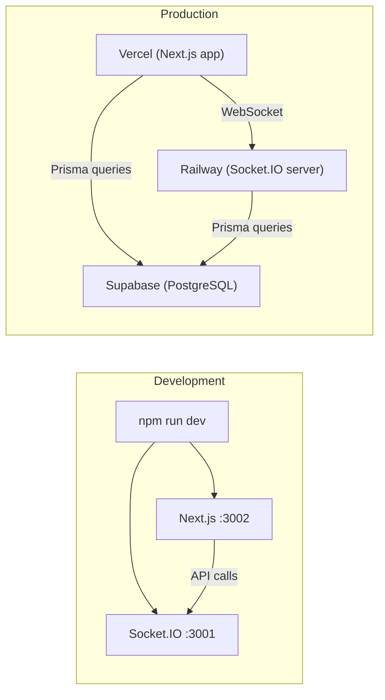
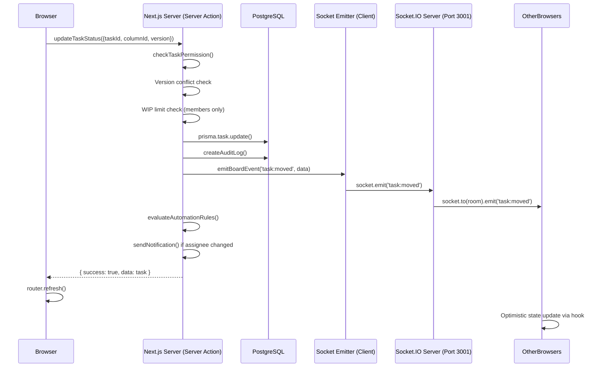
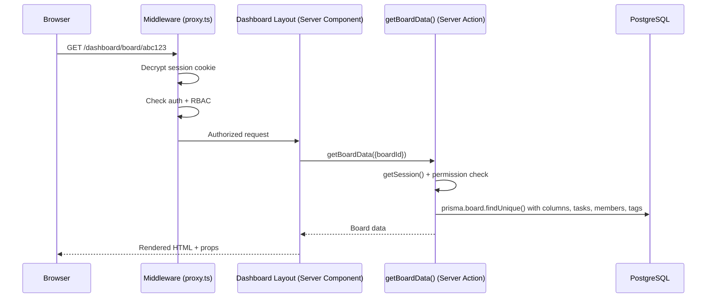
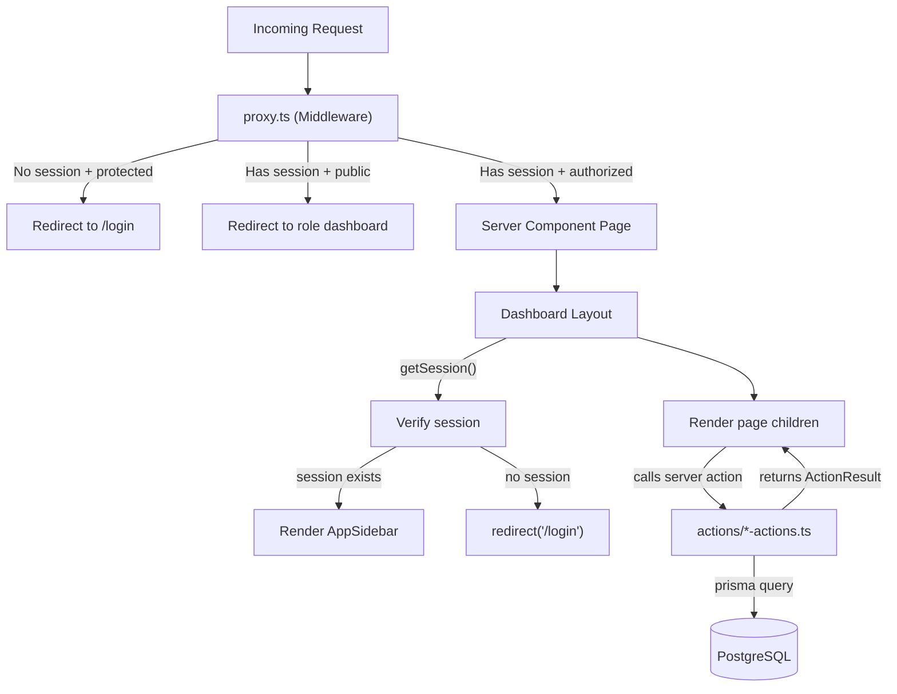

# SmartTask — System Architecture

## Table of Contents

- [Overview](#overview)
- [Technology Stack](#technology-stack)
- [High-Level Architecture](#high-level-architecture)
- [Process & Port Layout](#process--port-layout)
- [Directory Structure](#directory-structure)
- [Data Flow Overview](#data-flow-overview)
- [Server-Side Rendering Pipeline](#server-side-rendering-pipeline)
- [Key Architectural Decisions](#key-architectural-decisions)

---

## Overview

SmartTask is a **real-time Kanban board** application with role-based access control (RBAC), work-in-progress (WIP) limits, offline support, undo via audit log, and a task automation engine. It runs as two separate processes — a Next.js web server and a standalone Socket.IO server — both backed by a single PostgreSQL database.

---

## Technology Stack

| Layer | Technology | Version |
|-------|-----------|---------|
| Framework | Next.js (App Router) | 16.x |
| UI Library | React | 19.x |
| Database | PostgreSQL (Supabase) | — |
| ORM | Prisma v7 (with `@prisma/adapter-pg`) | 7.x |
| Real-time | Socket.IO (standalone server) | 4.x |
| Styling | Tailwind CSS | 4.x |
| UI Components | shadcn/radix-nova | — |
| State Management | Zustand | 5.x |
| Validation | Zod | 4.x |
| Auth | Custom JWT via `jose` | HS256 |
| Drag & Drop | dnd-kit | 6.x |
| Offline Storage | IndexedDB (via `idb`) | — |
| PDF Export | jsPDF + jspdf-autotable | — |
| Charts | Recharts | 3.x |

---

## High-Level Architecture



---

## Process & Port Layout



| Process | Dev Port | Production Host |
|---------|----------|-----------------|
| Next.js (App Router) | 3002 | Vercel |
| Socket.IO (standalone) | 3001 | Railway |
| PostgreSQL | 5432 | Supabase |

**Important:** Port 3002, not the default 3000. The `npm run dev` command runs `db:check` first (blocks if DB unreachable), then starts both servers concurrently.

---

## Directory Structure

```
smart-task/
├── actions/              # Server actions (all mutations)
│   ├── admin-actions.ts      # ADMIN-only: users, audit logs, stats
│   ├── auth-actions.ts       # Password reset, profile, change password
│   ├── automation-actions.ts # Automation rule CRUD + evaluation
│   ├── board-actions.ts      # Board/column CRUD, members, tags, undo
│   ├── dashboard-actions.ts  # Role-specific dashboard data
│   ├── manager-actions.ts    # MANAGER+: boards, team, analytics
│   ├── member-actions.ts     # Any auth user: tasks, boards, stats
│   ├── notification-actions.ts # Read/mark/delete notifications
│   ├── notification-preferences-actions.ts # Preference CRUD
│   └── task-actions.ts       # Task CRUD, comments, checklists, etc.
│
├── app/                  # Next.js App Router
│   ├── (auth)/               # Login, signup, forgot/reset password
│   ├── admin/                # Admin dashboard, users, automation, logs
│   ├── api/auth/             # Login, logout, signup, me, reset-password
│   ├── api/notifications/    # Notification check endpoint
│   ├── dashboard/            # Board list + board/[id] (Kanban view)
│   ├── manager/              # Manager dashboard, analytics, team
│   ├── member/               # Member dashboard, tasks, reports
│   └── profile/              # Profile edit + notification preferences
│
├── components/
│   ├── admin/                # Admin-specific UI components
│   ├── kanban/               # Board UI, task cards, dialogs, socket hooks
│   │   └── task-details/     # Task sidebar tabs (comments, checklists, etc.)
│   ├── providers/            # OfflineProvider
│   └── ui/                   # shadcn UI primitives (28 components)
│
├── hooks/
│   ├── use-kanban-board.ts   # DnD logic, board state, event handling
│   ├── use-task/             # Per-task-subsystem hooks (8 hooks)
│   └── use-mobile.ts         # Responsive breakpoint hook
│
├── lib/
│   ├── auth.ts               # JWT encrypt/decrypt (jose, HS256)
│   ├── auth-server.ts        # 'use server' — login/logout/getSession cookies
│   ├── prisma.ts             # Prisma singleton + pg adapter + re-exports
│   ├── schemas.ts            # Zod validation schemas (all inputs)
│   ├── create-audit-log.ts   # Auto-injects IP, creates AuditLog
│   ├── audit.ts              # getClientIp() from headers
│   ├── offline-db.ts         # IndexedDB wrapper for action queue
│   ├── offline-sync.ts       # Maps queue actions to server action calls
│   ├── export-report.ts      # PDF export with jsPDF
│   └── store/
│       └── use-offline-store.ts  # Zustand store for offline state
│
├── utils/
│   ├── socket-emitter.ts     # Socket.IO CLIENT — emits events to standalone server
│   ├── notification-utils.ts # sendNotification(), background checks, preference filter
│   ├── automation-utils.ts   # Trigger/condition/action option lists
│   ├── mail.ts               # Nodemailer password reset emails
│   ├── utils.ts              # cn() (clsx + tailwind-merge)
│   └── index.ts              # Barrel exports
│
├── types/
│   └── kanban.ts             # Shared types: ActionResult, Board, Task, User, etc.
│
├── src/
│   └── socket/
│       └── server.ts         # STANDALONE Socket.IO server (own Prisma, own pg pool)
│
├── prisma/
│   ├── schema.prisma         # Database schema (14 models, 2 enums)
│   └── seed.ts               # Seeds 3 users + demo board + demo tasks
│
├── proxy.ts                  # Next.js 16 middleware (auth guards + RBAC)
├── prisma.config.ts          # Prisma v7 config (uses DIRECT_URL for schema ops)
├── next.config.mjs           # CSP headers, security headers
└── railway.toml              # Railway deployment config
```

---

## Data Flow Overview

### Typical Mutation Flow (e.g., "Move Task")



### Read Flow (e.g., "Load Board")



---

## Server-Side Rendering Pipeline



Each dashboard layout (`app/dashboard/layout.tsx`, `app/admin/layout.tsx`, etc.) calls `getSession()` and renders a sidebar + notification bell. The board page at `app/dashboard/board/[id]/page.tsx` uses `-m-6` CSS to cancel the parent's `p-6` padding, rendering edge-to-edge.

---

## Key Architectural Decisions

| Decision | Rationale |
|----------|-----------|
| **Standalone Socket.IO server** | Vercel's serverless functions cannot hold persistent WebSocket connections. A separate process on Railway keeps connections alive. |
| **Socket emitter is a client** | `utils/socket-emitter.ts` connects to the Socket.IO server as a client, so server actions can emit events without importing server code. |
| **Prisma `@prisma/adapter-pg`** | Required for Prisma v7. Uses a `pg.Pool` for connection management. NOT `@prisma/adapter-neon` despite both being in `package.json`. |
| **`db push` not migrations** | Simpler for rapid iteration. `prisma.config.ts` uses `DIRECT_URL` for schema operations (falls back to `DATABASE_URL`). |
| **Custom JWT (not NextAuth)** | Lightweight. `jose` handles HS256 signing. HTTP-only cookies prevent XSS. No refresh tokens — 7-day expiry with session refresh in middleware. |
| **`proxy.ts` not `middleware.ts`** | Next.js 16 auto-detects `proxy.ts` as middleware. Name chosen to avoid confusion. |
| **Server actions (not API routes)** | Most mutations use `'use server'` actions for type safety. Only auth login/signup/reset remain as API routes (Turbopack compatibility). |
| **Optimistic concurrency** | Tasks have a `version` field. Client sends version with updates; server rejects if stale. |
| **Audit log as undo mechanism** | `undoLastAction()` reads the most recent audit log entry and reverses the mutation using stored previous state. 30-second window. |
| **Offline queue via IndexedDB** | When offline, mutations are queued in IndexedDB. Zustand manages queue state. Synced via `lib/offline-sync.ts` when back online. |
| **Background worker inline** | The Socket.IO server runs due-date/overdue checks every 60s and audit log cleanup at midnight — no separate cron service needed. |
