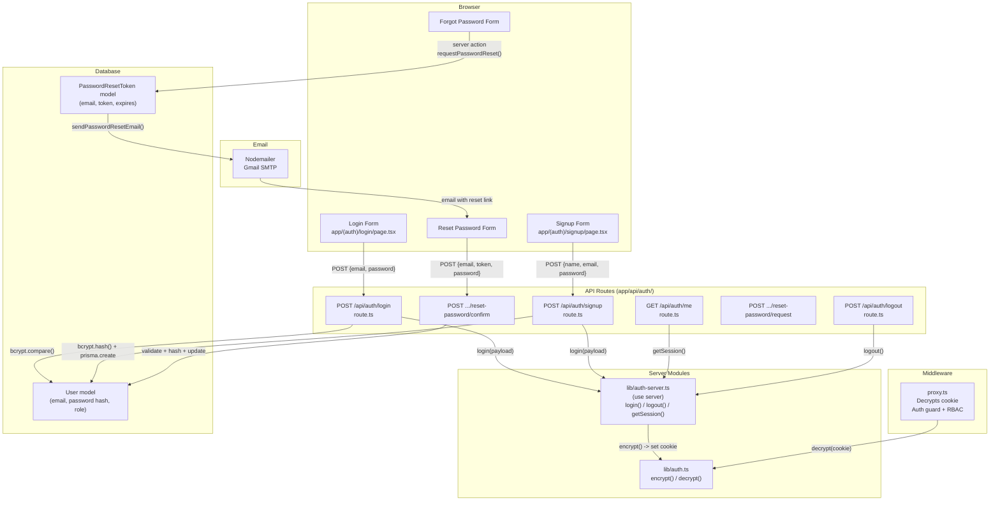
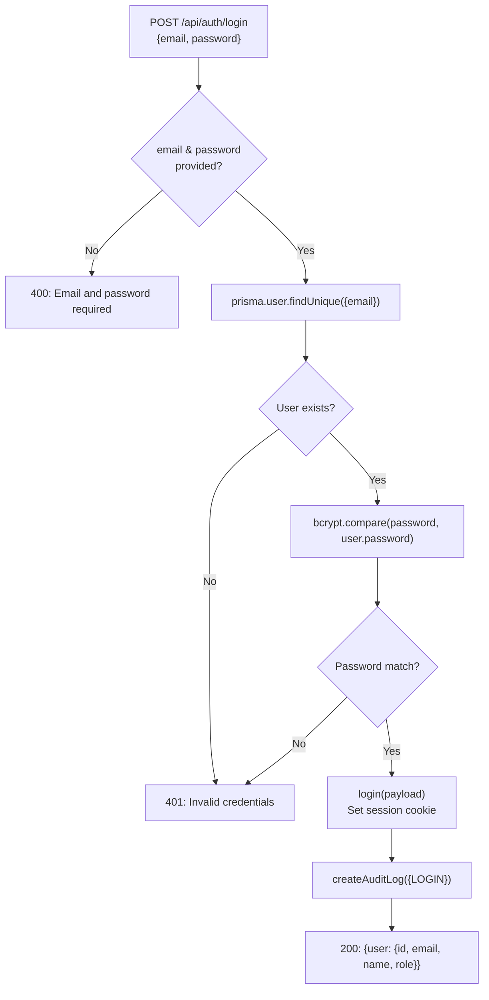
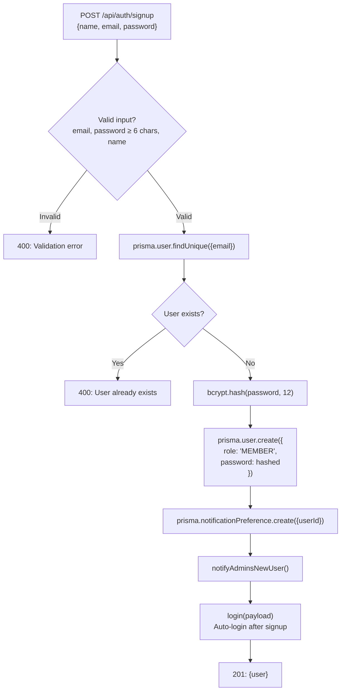
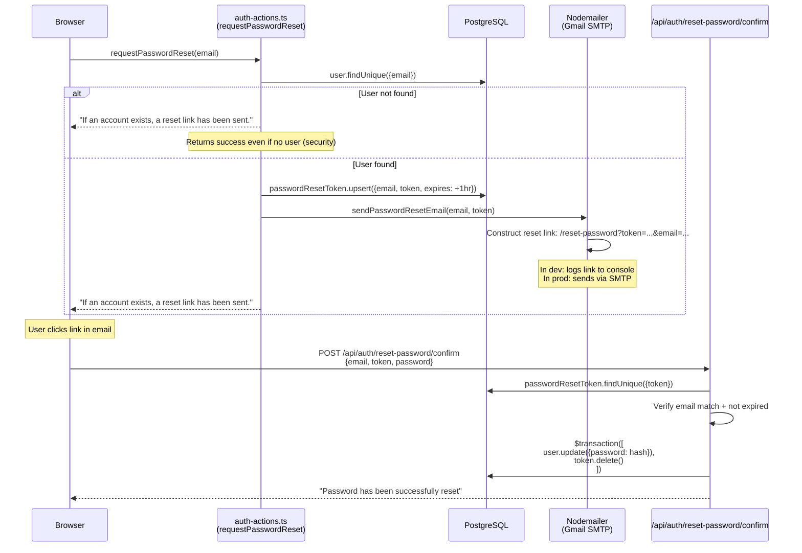
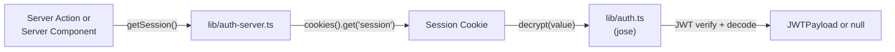

# SmartTask — Authentication System

## Table of Contents

- [Overview](#overview)
- [Architecture Diagram](#architecture-diagram)
- [JWT Session Flow](#jwt-session-flow)
- [Login Flow](#login-flow)
- [Signup Flow](#signup-flow)
- [Password Reset Flow](#password-reset-flow)
- [Session Management](#session-management)
- [Middleware (proxy.ts)](#middleware-proxyts)
- [File Map](#file-map)

---

## Overview

SmartTask uses **custom JWT-based authentication** with HTTP-only cookies. There is no third-party auth provider (no NextAuth, no Clerk). The system uses the `jose` library for HS256 signing, 7-day token expiry, and session refresh via middleware.

Key principles:
- **Login and signup are API routes** (`POST /api/auth/login`, `POST /api/auth/signup`) — NOT server actions
- **All other cookie operations** (logout, getSession) use the `'use server'` module `lib/auth-server.ts`
- **Middleware** (`proxy.ts`) decrypts the session cookie on every request for auth guards
- **Password reset** uses a `PasswordResetToken` model with 1-hour expiry and email delivery via Nodemailer

---

## Architecture Diagram



---

## JWT Session Flow

```mermaid
sequenceDiagram
    participant Browser
    participant Proxy as proxy.ts<br/>(Middleware)
    participant AuthLib as lib/auth.ts<br/>(jose)
    participant AuthServer as lib/auth-server.ts<br/>(use server)
    participant DB as PostgreSQL

    Note over Browser,DB: === LOGIN ===

    Browser->>+AuthLib: POST /api/auth/login {email, password}
    AuthLib->>DB: prisma.user.findUnique({email})
    AuthLib->>AuthLib: bcrypt.compare(password, hash)
    AuthLib->>AuthServer: login({id, email, name, role})
    AuthServer->>AuthLib: encrypt(payload) → JWT string
    AuthLib-->>-Browser: Set-Cookie: session=<jwt>; HttpOnly; SameSite=Lax; 7-day expiry

    Note over Browser,DB: === SUBSEQUENT REQUEST ===

    Browser->>Proxy: GET /dashboard (with session cookie)
    Proxy->>AuthLib: decrypt(cookie)
    AuthLib-->>Proxy: {id, email, name, role}
    Proxy->>Proxy: Check RBAC rules
    Proxy-->>Browser: Allow or redirect

    Note over Browser,DB: === SESSION REFRESH ===

    Proxy->>AuthServer: updateSession(request)
    AuthServer->>AuthLib: decrypt(session) → re-encrypt with new expiry
    AuthServer-->>Browser: Set-Cookie: session=<new-jwt>
```

### JWT Payload Structure

```typescript
// Defined in lib/auth.ts
interface JWTPayload {
  id: string        // User ID (cuid)
  email: string
  name: string | null
  image: string | null
  role: 'ADMIN' | 'MANAGER' | 'MEMBER'
}
```

### Cookie Settings

| Property | Value |
|----------|-------|
| Name | `session` |
| HTTP-Only | `true` |
| Secure | `true` in production, `false` in dev |
| SameSite | `lax` |
| Path | `/` |
| Expiry | 7 days from issuance |
| Algorithm | HS256 |

---

## Login Flow

**File:** `app/api/auth/login/route.ts`



**Why an API route and not a server action?** Turbopack's dev server fails to resolve `cookies()` at runtime in server action files in certain edge cases. API routes with `'use server'` imports from `auth-server.ts` work reliably.

---

## Signup Flow

**File:** `app/api/auth/signup/route.ts`



### Signup Defaults

- New users always get **MEMBER** role
- A **default NotificationPreference** record is created (all notifications enabled, email/push disabled)
- User is **auto-logged in** immediately after signup
- All **ADMIN users** receive a `NEW_USER_SIGNUP` notification

---

## Password Reset Flow

**Files:** `actions/auth-actions.ts` (server actions), `app/api/auth/reset-password/request/route.ts` and `confirm/route.ts` (API routes), `utils/mail.ts` (email)



### Token Model

```prisma
model PasswordResetToken {
  id        String   @id @default(cuid())
  email     String   @unique
  token     String   @unique
  expires   DateTime
  createdAt DateTime @default(now())

  @@unique([email, token])
}
```

- Token: 32 random hex bytes (`crypto.randomBytes(32).toString('hex')`)
- Expiry: 1 hour
- Upsert: If a token already exists for the email, it is replaced
- Cleanup: Token is deleted in the same transaction as the password update

---

## Session Management

### Getting the Current Session

All three methods resolve to the same flow:



### Where `getSession()` is Called

| Caller | Purpose |
|--------|---------|
| `proxy.ts` (middleware) | Auth guard: decrypt cookie, check role, allow/redirect |
| Dashboard layouts (`app/*/layout.tsx`) | Pass session to sidebar, redirect if no session |
| Server actions (`actions/*`) | Verify user is authenticated before mutations |
| API routes (`app/api/auth/me`) | Return current user for client-side checks |

### Session Refresh

The middleware does NOT currently refresh the session on every request (the `updateSession` function exists in `auth-server.ts` but is not called by `proxy.ts`). The session expires 7 days after login.

---

## Middleware (proxy.ts)

**File:** `proxy.ts` at project root

```mermaid
flowchart TD
    REQ["Incoming Request"] --> MATCH{"Matches route<br/>pattern?"}
    MATCH -->|No| NEXT["NextResponse.next()"]
    MATCH -->|Yes| COOKIE{"Session cookie<br/>present?"}

    COOKIE -->|No cookie + protected route| REDIRECT_LOGIN["Redirect → /login"]
    COOKIE -->|Has cookie| DECRYPT["decrypt(cookie)"]

    DECRYPT --> FAIL{"Decrypt<br/>success?"}
    FAIL -->|Error| REDIRECT_LOGIN
    FAIL -->|Success| SESSION["session = {id, email, role}"]

    SESSION --> ROUTE{"Route check"}
    ROUTE -->|"/admin" + role ≠ ADMIN| REDIRECT_DASH["Redirect → /dashboard"]
    ROUTE -->|"/manager" + role ∉ [ADMIN, MANAGER]| REDIRECT_DASH
    ROUTE -->|"/member" + role ∉ [ADMIN, MANAGER, MEMBER]| REDIRECT_DASH
    ROUTE -->|"/login" or "/signup" + has session| REDIRECT_DASH2["Redirect → /dashboard"]
    ROUTE -->|Authorized| NEXT

    style REDIRECT_LOGIN fill:#fee,stroke:#c00
    style REDIRECT_DASH fill:#fee,stroke:#c00
    style NEXT fill:#efe,stroke:#0a0
```

### Protected Routes

| Route Prefix | Required Role |
|-------------|---------------|
| `/dashboard` | Any authenticated user |
| `/admin` | ADMIN |
| `/manager` | ADMIN or MANAGER |
| `/member` | ADMIN, MANAGER, or MEMBER |
| `/settings` | Any authenticated user |
| `/boards` | Any authenticated user |
| `/profile` | Any authenticated user |

### Public Routes (redirect to dashboard if logged in)

- `/login`
- `/signup`
- `/` (landing page)

### Matcher Pattern

```typescript
matcher: ['/((?!api|_next/static|_next/image|.*\\.png$).*)']
```

Skips API routes, static files, and images from middleware processing.

---

## File Map

| File | Responsibility |
|------|---------------|
| `lib/auth.ts` | JWT encrypt/decrypt using `jose` (HS256, 7-day expiry) |
| `lib/auth-server.ts` | `'use server'` module: login(), logout(), getSession(), updateSession() — all cookie operations |
| `proxy.ts` | Next.js 16 middleware: auth guards, RBAC redirects, session decryption |
| `app/api/auth/login/route.ts` | POST handler: validate credentials, set session cookie |
| `app/api/auth/signup/route.ts` | POST handler: create user, auto-login |
| `app/api/auth/logout/route.ts` | POST handler: clear session cookie |
| `app/api/auth/me/route.ts` | GET handler: return current user from session |
| `app/api/auth/reset-password/request/route.ts` | POST: create reset token, send email |
| `app/api/auth/reset-password/confirm/route.ts` | POST: validate token, update password |
| `actions/auth-actions.ts` | Server actions: requestPasswordReset, resetPassword, updateProfile, changePassword, getUserProfile |
| `utils/mail.ts` | Nodemailer transport + sendPasswordResetEmail() |
| `app/(auth)/login/page.tsx` | Login UI |
| `app/(auth)/signup/page.tsx` | Signup UI |
| `app/(auth)/forgot-password/page.tsx` | Forgot password UI |
| `app/(auth)/reset-password/page.tsx` | Reset password UI |
