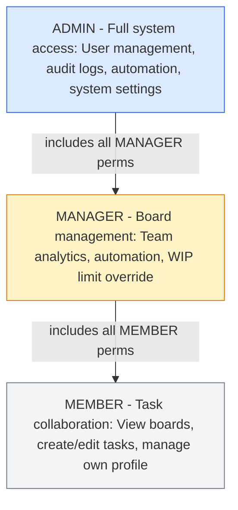
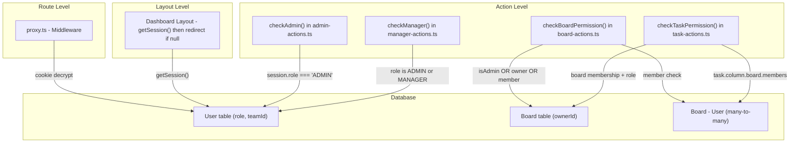
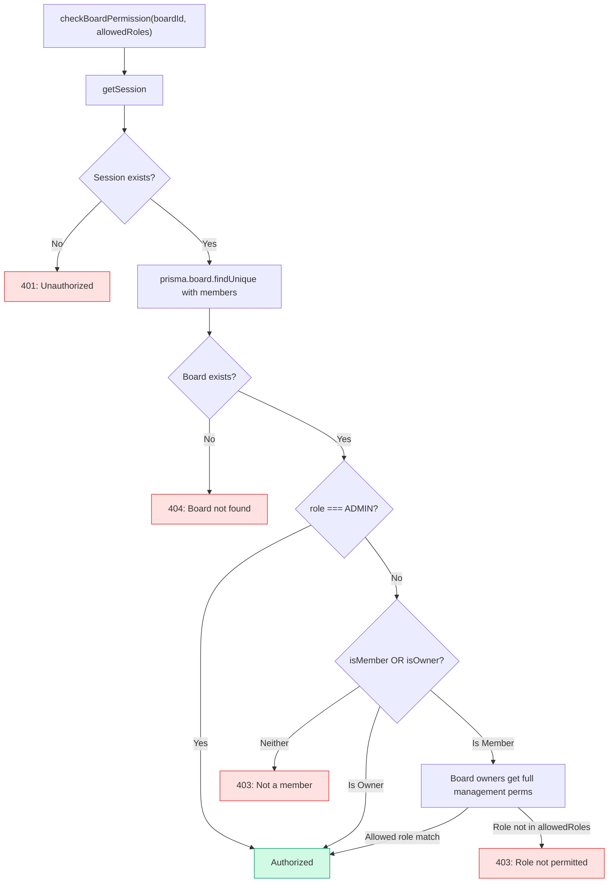
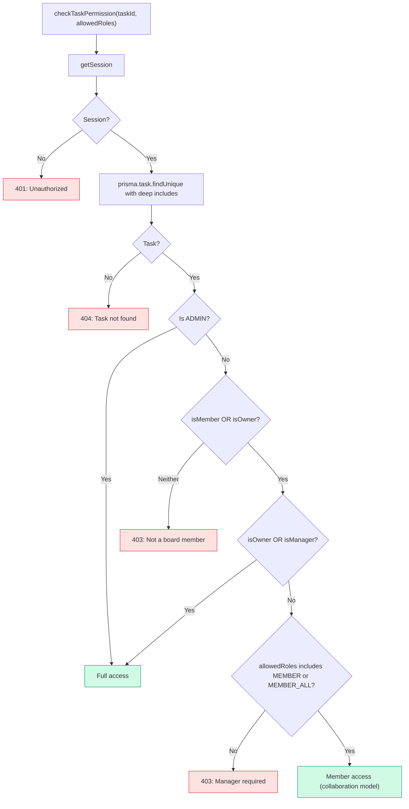
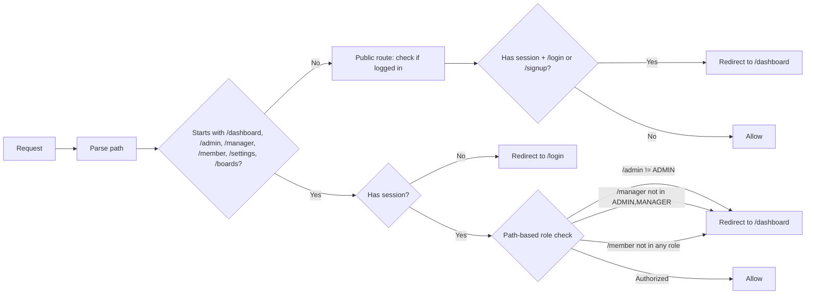
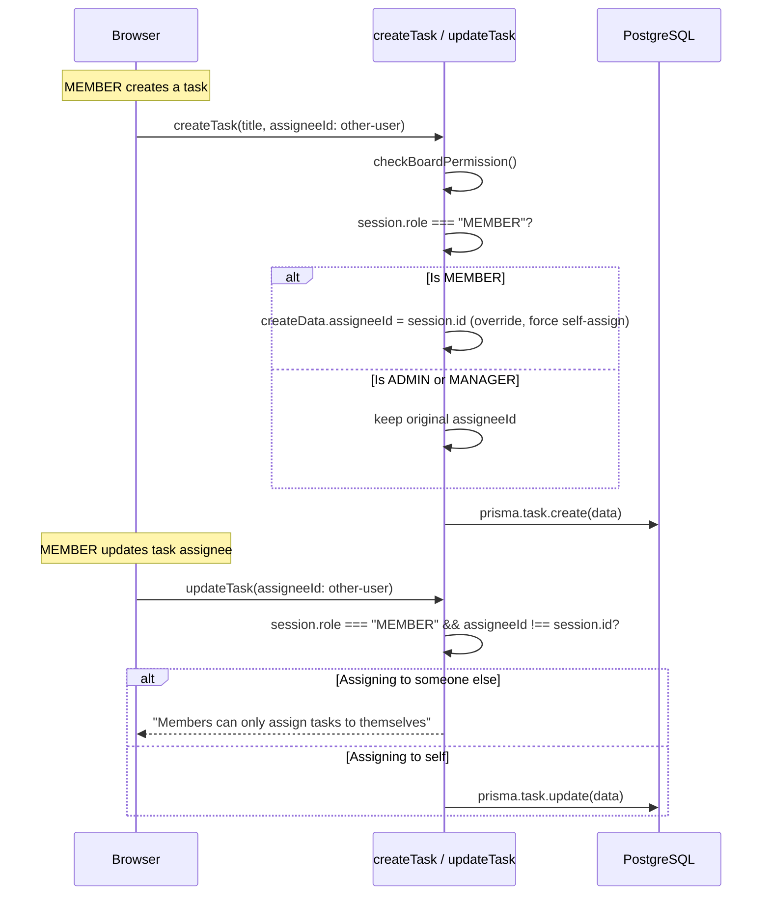
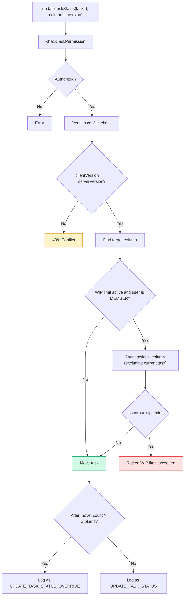

# SmartTask — RBAC & Permissions

## Table of Contents

- [Overview](#overview)
- [Role Hierarchy](#role-hierarchy)
- [Permission Matrix](#permission-matrix)
- [Authorization Architecture](#authorization-architecture)
- [Board Permission Flow](#board-permission-flow)
- [Task Permission Flow](#task-permission-flow)
- [Route-Level Guards](#route-level-guards)
- [Member Assignment Rules](#member-assignment-rules)
- [WIP Limit Enforcement](#wip-limit-enforcement)

---

## Overview

SmartTask implements **three roles** with hierarchical permissions: ADMIN > MANAGER > MEMBER. RBAC checks are enforced at three levels:

1. **Route level** — `proxy.ts` middleware redirects unauthorized users
2. **Dashboard layout level** — Server components verify session before rendering
3. **Server action level** — Each action calls a private `checkAdmin()`, `checkManager()`, `checkBoardPermission()`, or `checkTaskPermission()` before executing

---

## Role Hierarchy

| Role | DB Value | Dashboard Route |
|------|----------|-----------------|
| Administrator | `ADMIN` | `/admin` |
| Manager | `MANAGER` | `/manager` |
| Member | `MEMBER` | `/member` |

All roles share `/dashboard` (redirects to role-specific dashboard) and `/profile`.

---

## Permission Matrix

### System-Level Permissions

| Action | ADMIN | MANAGER | MEMBER |
|--------|:-----:|:-------:|:------:|
| View admin dashboard | ✓ | ✗ | ✗ |
| Manage users (CRUD) | ✓ | ✗ | ✗ |
| View audit logs (all) | ✓ | ✗ | ✗ |
| View audit logs (team) | ✓ | ✓ | ✗ |
| View own audit logs | ✓ | ✓ | ✓ |
| System reports & export | ✓ | ✗ | ✗ |
| Database backups | ✓ | ✗ | ✗ |

### Board-Level Permissions

| Action | ADMIN | MANAGER | MEMBER |
|--------|:-----:|:-------:|:------:|
| Create boards | ✓ | ✓ | ✗ |
| Delete boards | ✓ | ✓ (own) | ✗ |
| Edit board name/description | ✓ | ✓ (own) | ✗ |
| Add/remove members | ✓ | ✓ (own) | ✗ |
| Create/edit/delete columns | ✓ | ✓ (own) | ✗ |
| Set WIP limits | ✓ | ✓ (own) | ✗ |
| Reorder columns | ✓ | ✓ (own) | ✗ |
| Create board tags | ✓ | ✓ (own) | ✗ |
| Create global tags | ✓ | ✗ | ✗ |
| View any board | ✓ | Boards they're in | Boards they're in |

### Task-Level Permissions

| Action | ADMIN | MANAGER | MEMBER |
|--------|:-----:|:-------:|:------:|
| Create tasks | ✓ | ✓ | ✓ (self-assign only) |
| Edit tasks | ✓ | ✓ | ✓ (any task in board) |
| Delete tasks | ✓ | ✓ | ✓ (any task in board) |
| Move tasks (drag) | ✓ | ✓ (WIP override) | ✓ (WIP enforced) |
| Assign tasks | ✓ | ✓ (anyone) | ✓ (self only) |
| Add comments | ✓ | ✓ | ✓ |
| Edit own comments | ✓ (any time) | ✓ (any time) | ✓ (5 min window) |
| Delete comments | ✓ | ✓ (any) | ✓ (own only) |
| Add checklists/items | ✓ | ✓ | ✓ |
| Add attachments | ✓ | ✓ | ✓ |
| Log time | ✓ | ✓ | ✓ |
| Submit for review | ✓ | ✓ | ✓ |
| Complete reviews | ✓ | ✓ (any) | ✓ (if reviewer) |
| Add/remove tags | ✓ | ✓ | ✓ |

### Automation Permissions

| Action | ADMIN | MANAGER | MEMBER |
|--------|:-----:|:-------:|:------:|
| View automation rules | ✓ | ✓ | ✗ |
| Create system-wide rules | ✓ | ✗ | ✗ |
| Create board rules | ✓ | ✓ | ✗ |
| Toggle/delete rules | ✓ | ✓ (board rules) | ✗ |

---

## Authorization Architecture

---

## Board Permission Flow

**Function:** `checkBoardPermission()` in `actions/board-actions.ts`

### Default `allowedRoles` by Action

| Action | allowedRoles |
|--------|-------------|
| `createBoard` | `['ADMIN', 'MANAGER']` (checked manually, not via `checkBoardPermission`) |
| `updateBoard` | `['ADMIN', 'MANAGER']` |
| `deleteBoard` | `['ADMIN', 'MANAGER']` |
| `createColumn` | `['ADMIN', 'MANAGER']` |
| `updateColumn` | `['ADMIN', 'MANAGER']` |
| `addBoardMember` | `['ADMIN', 'MANAGER']` |
| `removeBoardMember` | `['ADMIN', 'MANAGER']` |
| `getBoardData` | Any member (checked manually) |

---

## Task Permission Flow

**Function:** `checkTaskPermission()` in `actions/task-actions.ts`

### Collaboration Model

Members operate under a **collaboration model**: any board member can edit, delete, add comments, checklists, attachments, tags, and time entries to **any task** in their board — not just their own. The only restriction is that members can only **assign tasks to themselves** (enforced server-side).

---

## Route-Level Guards

**File:** `proxy.ts`

---

## Member Assignment Rules

---

## WIP Limit Enforcement

**Key points:**
- WIP limits are **only enforced for MEMBER role**
- ADMIN and MANAGER can always move tasks, even past the limit
- When an admin/manager exceeds the limit, the audit log records `UPDATE_TASK_STATUS_OVERRIDE` instead of `UPDATE_TASK_STATUS`
- The override check is done **after** the move (retroactive detection)
