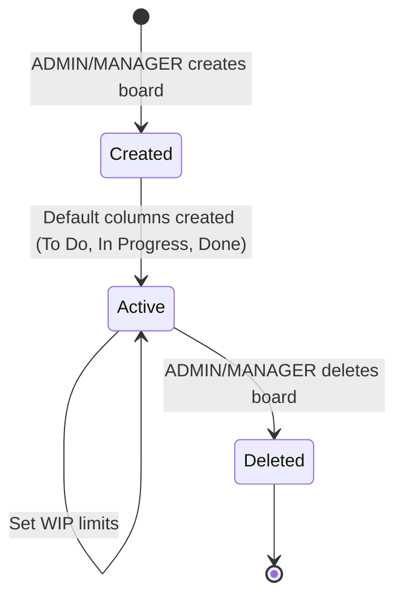
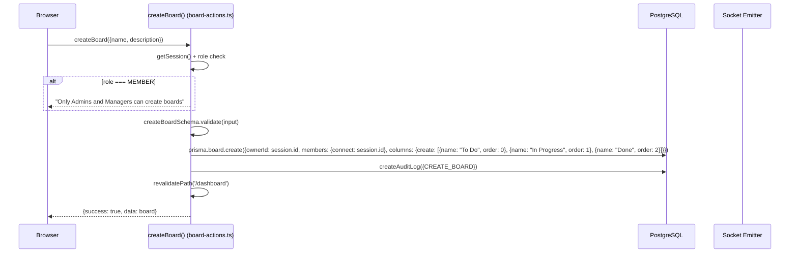
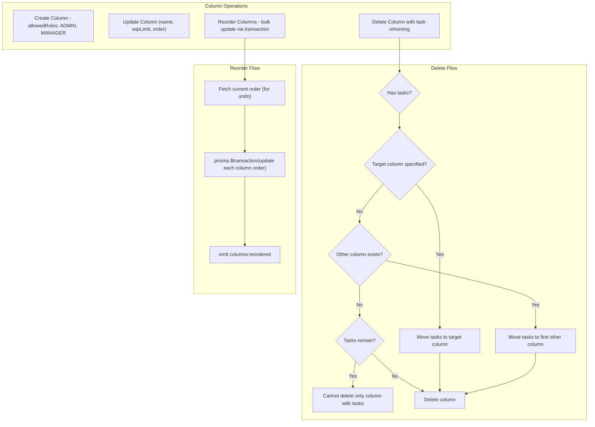
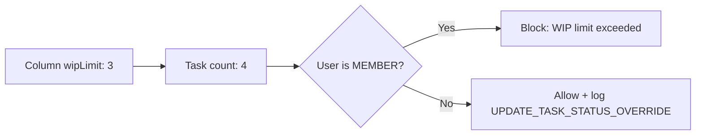
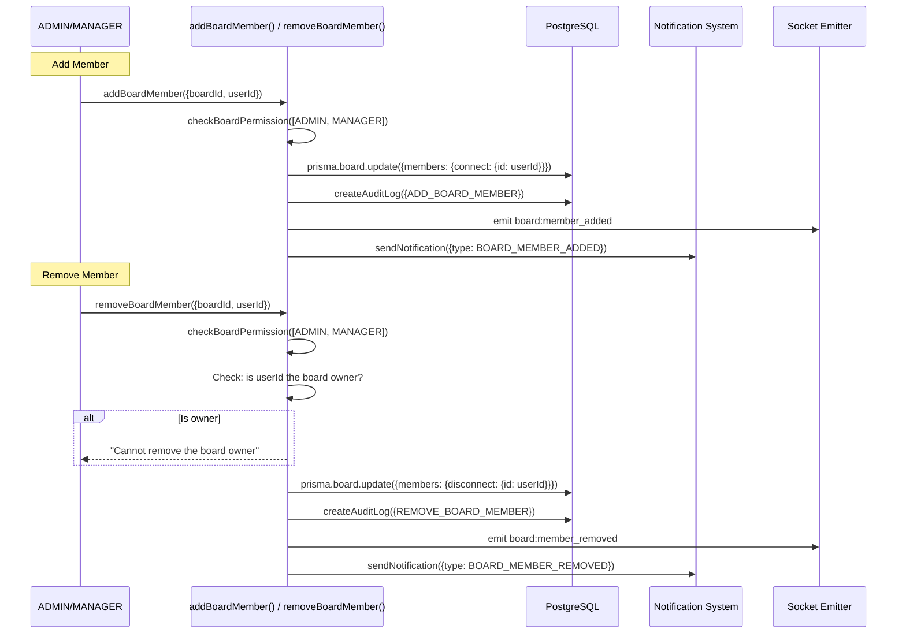
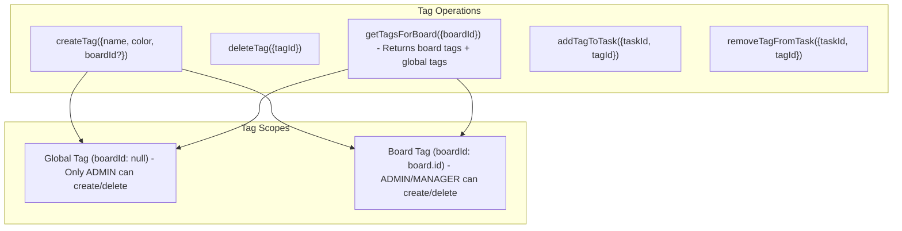
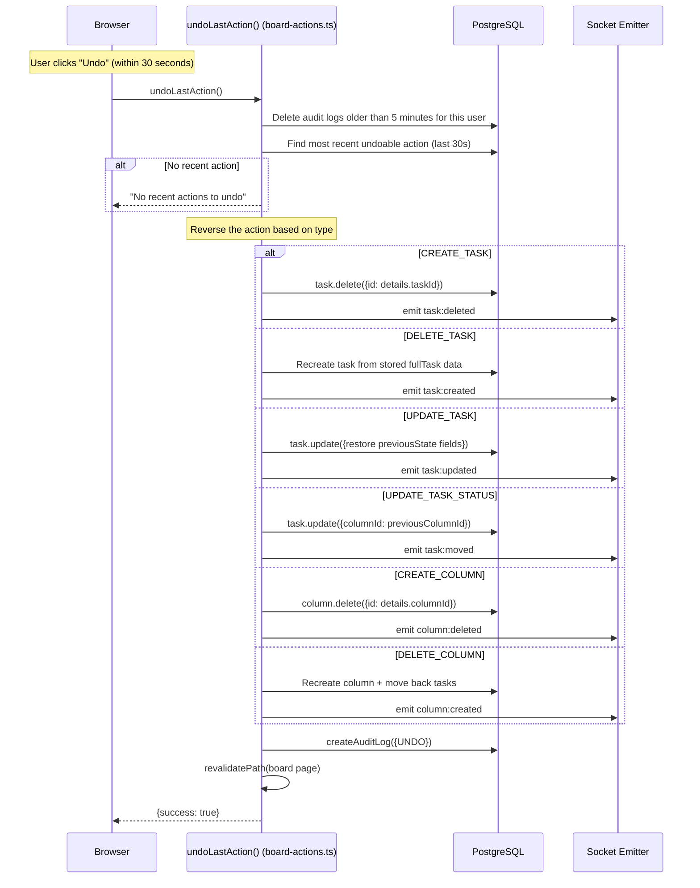

# SmartTask — Board Management

## Table of Contents

- [Overview](#overview)
- [Board Lifecycle](#board-lifecycle)
- [Column Management](#column-management)
- [WIP Limits](#wip-limits)
- [Board Membership](#board-membership)
- [Tags](#tags)
- [Undo System](#undo-system)
- [File Map](#file-map)

---

## Overview

Boards are the primary organizational unit. Each board has an **owner**, multiple **members** (many-to-many), **columns** (ordered, with optional WIP limits), and **tags**. Boards can only be created by ADMIN or MANAGER roles. The board page at `app/dashboard/board/[id]/page.tsx` is the main Kanban view, rendering edge-to-edge via a CSS `-m-6` trick.

---

## Board Lifecycle

### Create Board Flow

**Key details:**
- The creator is automatically set as `ownerId`
- The creator is automatically added as a member
- Three default columns are created: "To Do" (order 0), "In Progress" (order 1), "Done" (order 2)
- Validation: name max 50 chars, description max 255 chars

---

## Column Management

### Delete Column with Task Rehoming

When a column is deleted, its tasks are moved to another column (either specified by the user or the first available column). The moved task IDs are stored in the audit log for undo support.

### Reorder Columns

Uses a Prisma `$transaction` to update all column orders atomically. The previous order is stored in the audit log for undo.

---

## WIP Limits

Each column has a `wipLimit` field (default: 0, meaning unlimited).

- **WIP limit of 0** = unlimited (no restriction)
- Only enforced for MEMBER role
- ADMIN/MANAGER always bypass (logged as override)
- Can be set per column via `updateColumnWipLimit()` or `updateColumn()`

---

## Board Membership

**Key rules:**
- Cannot remove the board owner
- Notifications are NOT sent when adding/removing yourself
- User search for adding members: `searchUsers()` searches by name or email (case-insensitive, max 10 results)

---

## Tags

Tags are a many-to-many relationship between `Tag` and `Task`. When fetching tags for a board, both board-specific tags and global tags are returned.

---

## Undo System

The undo system uses the **audit log as a reversible operation log**. It works within a **30-second window** after the original action.

### Undoable Actions (30-second window)

| Audit Action | Undo Behavior |
|-------------|---------------|
| `CREATE_TASK` | Delete the task |
| `DELETE_TASK` | Recreate task with all sub-resources (checklists, comments, attachments, time entries, reviews) |
| `UPDATE_TASK` | Restore previous field values |
| `UPDATE_TASK_STATUS` | Move task back to previous column |
| `UPDATE_TASK_STATUS_OVERRIDE` | Same as above |
| `CREATE_COLUMN` | Delete the column |
| `DELETE_COLUMN` | Recreate column + move tasks back |
| `UPDATE_COLUMN` | Restore name/wipLimit |
| `UPDATE_COLUMN_WIP_LIMIT` | Restore previous WIP limit |
| `REORDER_COLUMNS` | Restore previous column order |
| `DELETE_COMMENT` | Recreate comment |
| `DELETE_CHECKLIST_ITEM` | Recreate checklist item |
| `DELETE_ATTACHMENT` | Recreate attachment |
| `COMPLETE_REVIEW` | Restore review status + move task back |
| `ADD_TAG` | Remove tag from task |
| `REMOVE_TAG` | Add tag back to task |
| `TOGGLE_CHECKLIST_ITEM` | Toggle completion state back |
| `ADD_COMMENT` | Delete the comment |
| `ADD_CHECKLIST_ITEM` | Delete the item |
| `UPDATE_CHECKLIST_ITEM` | Restore previous content |
| `ADD_ATTACHMENT` | Delete the attachment |
| `LOG_TIME` | Delete the time entry |
| `SUBMIT_REVIEW` | Delete the review |

### Important Constraints

- **30-second window** — only actions within the last 30 seconds can be undone
- **5-minute log cleanup** — every undo call also deletes audit logs older than 5 minutes for the user (housekeeping)
- **Version increment** — undo operations on tasks still increment the `version` field to prevent stale state

---

## File Map

| File | Responsibility |
|------|---------------|
| `actions/board-actions.ts` | Board/column CRUD, members, tags, undo, search users |
| `components/kanban/create-board-dialog.tsx` | Create board dialog |
| `components/kanban/edit-board-dialog.tsx` | Edit board name/description |
| `components/kanban/manage-members-dialog.tsx` | Add/remove board members |
| `components/kanban/add-column-dialog.tsx` | Create column dialog |
| `components/kanban/rename-column-dialog.tsx` | Rename column dialog |
| `components/kanban/set-wip-limit-dialog.tsx` | Set WIP limit dialog |
| `components/kanban/kanban-board.tsx` | Main board component (DnD context) |
| `components/kanban/column-container.tsx` | Column with tasks list |
| `components/kanban/board-header.tsx` | Board title, members, settings |
| `app/dashboard/board/[id]/page.tsx` | Board page (edge-to-edge rendering) |
| `hooks/use-kanban-board.ts` | DnD logic, board state, event handlers |
| `lib/schemas.ts` | Zod schemas for board/column/tag operations |
