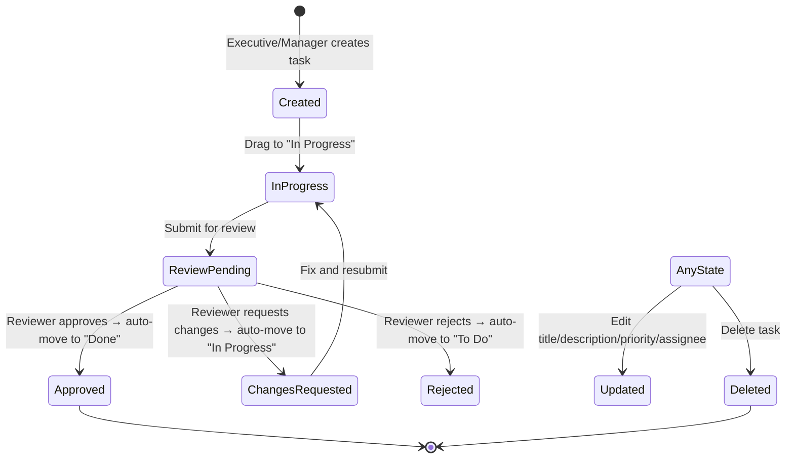
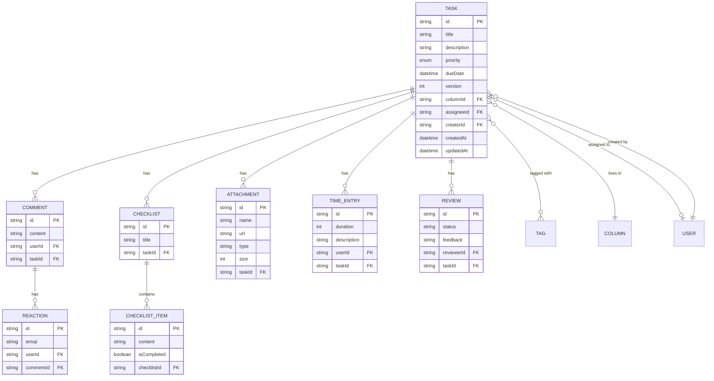
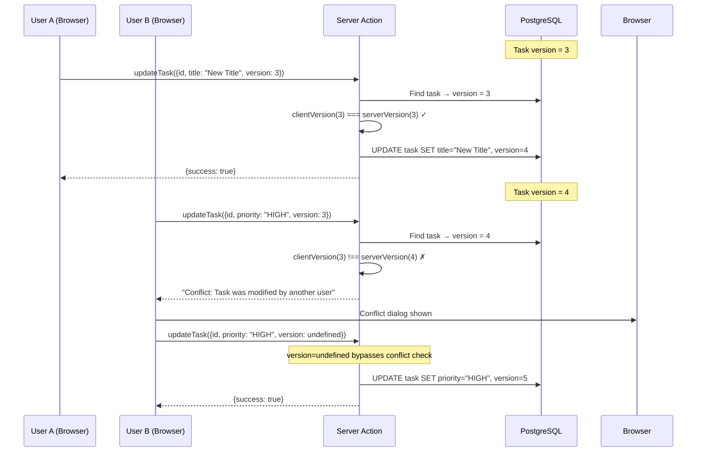
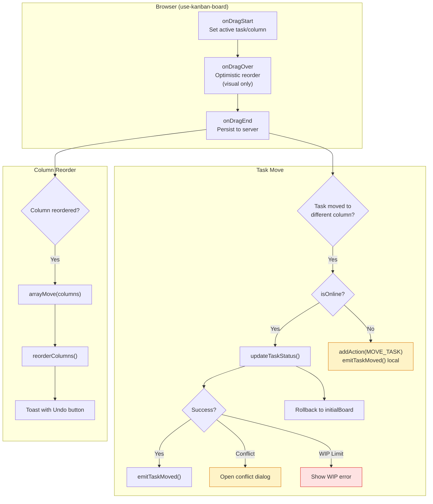
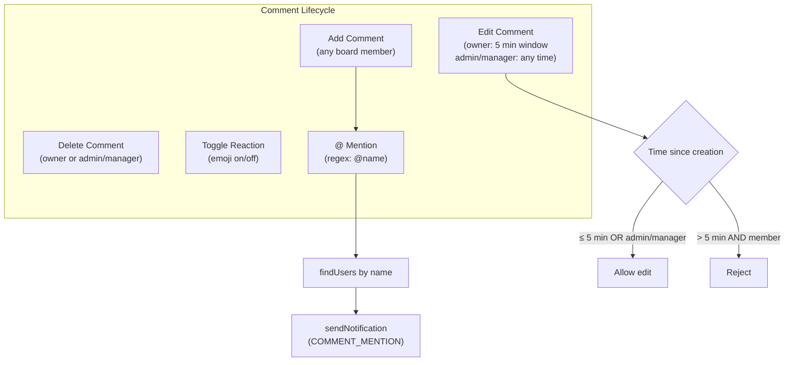
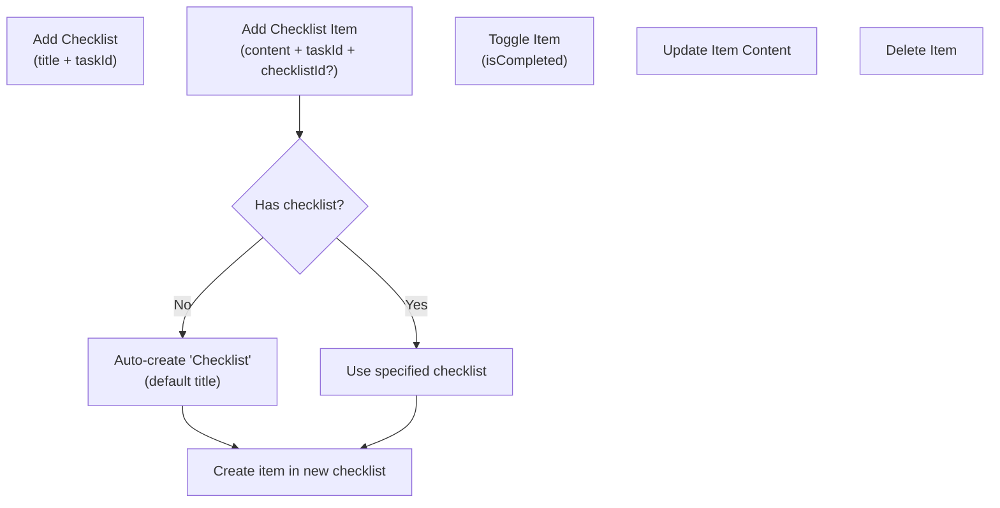
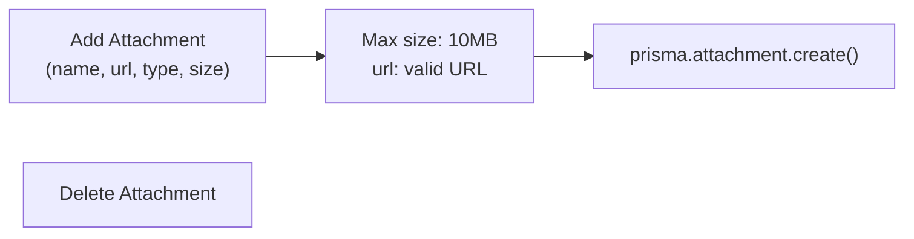
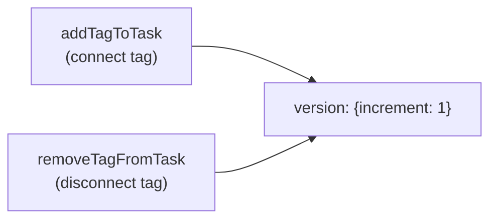
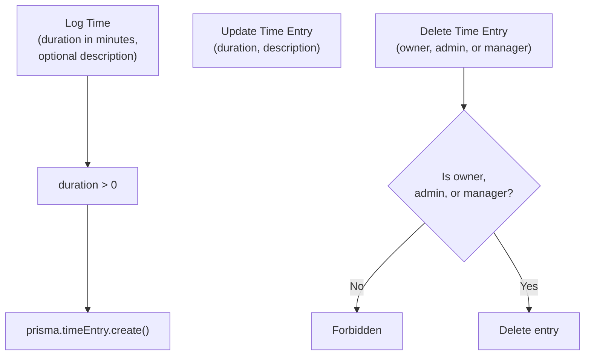
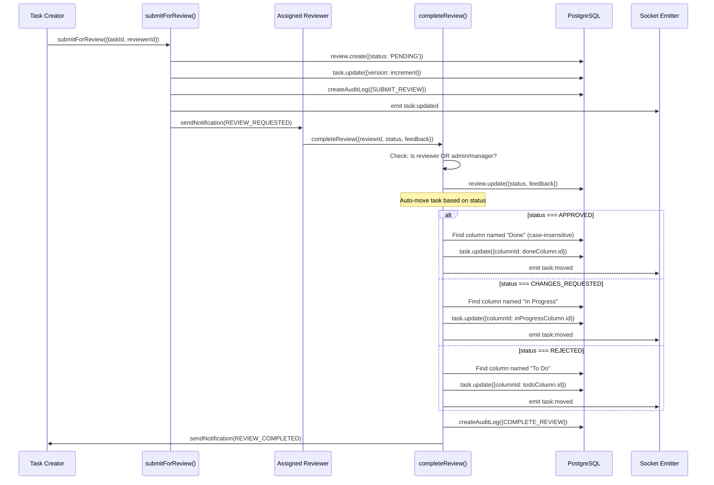

# SmartTask — Task Management

## Table of Contents

- [Overview](#overview)
- [Task Lifecycle](#task-lifecycle)
- [Task Data Model](#task-data-model)
- [Version Conflict Detection](#version-conflict-detection)
- [Drag and Drop Flow](#drag-and-drop-flow)
- [Task Sub-Systems](#task-sub-systems)
  - [Comments](#comments)
  - [Checklists](#checklists)
  - [Attachments](#attachments)
  - [Tags](#tags)
  - [Time Tracking](#time-tracking)
  - [Reviews](#reviews)
- [File Map](#file-map)

---

## Overview

Tasks are the core work items in SmartTask. They live inside columns on boards. Each task supports a rich set of sub-systems: comments with reactions and @mentions, checklists, file attachments, tags, time tracking, and a review/approval workflow. Tasks use **optimistic concurrency** via a `version` field to prevent lost updates.

---

## Task Lifecycle

### Status Mapping (by column name)

Tasks don't have an explicit status field. Their "status" is determined by which column they're in. The system recognizes columns by **case-insensitive name matching**:

| Column Name Pattern | Status Meaning |
|--------------------|---------------|
| Contains "done" or "complete" | Done/Completed |
| Contains "progress" or "doing" | In Progress |
| Contains "todo" or "to do" | To Do |
| Contains "block" | Blocked |

---

## Task Data Model

---

## Version Conflict Detection

**How it works:**
1. Every task has an integer `version` field (starts at 1)
2. On every update, the client sends the `version` it last saw
3. The server compares: if they match, proceed; if not, reject with conflict error
4. On success, the server increments `version` via `version: { increment: 1 }`
5. The conflict dialog can bypass by sending `version: undefined`

---

## Drag and Drop Flow

**Hook:** `hooks/use-kanban-board.ts` using `@dnd-kit/core`

### Optimistic Updates

During `onDragOver`, the board state is updated **optimistically** in memory (purely visual). If the server rejects the move (WIP limit, conflict, permission), the board state is rolled back to `initialBoard` (the last confirmed state from the server).

### Offline Drag

When offline (`isOnline === false`):
1. The task move is queued in IndexedDB via `addAction({type: 'MOVE_TASK'})`
2. The socket event is emitted locally for other tabs
3. A toast shows "Task moved locally (offline)"
4. On reconnect, `offline-sync.ts` replays the queued action

---

## Task Sub-Systems

### Comments

**Files:** `actions/task-actions.ts` (addComment, editComment, deleteComment, toggleReaction)

**Mention parsing:** Uses regex `/@([\w\s]+?)(?=\s|$|[,.!?:;])/g` to extract names from comment content. Matches are looked up case-insensitively in the database.

**Edit window:** `FIVE_MINUTES_MS = 5 * 60 * 1000` (5 minutes). Non-admin/manager users can only edit within this window.

### Checklists

If no `checklistId` is provided when adding an item, the system auto-creates a checklist with title "Checklist" if none exists.

### Attachments

Attachments store a URL (typically from client-side upload to a file service). Max size validated via Zod schema: `10 * 1024 * 1024` bytes.

### Tags

Tag operations on tasks increment the task version to trigger real-time updates.

### Time Tracking

Duration is stored in **minutes** (integer). Only the entry owner, ADMIN, or MANAGER can delete or edit time entries.

### Reviews

**Key behavior:** Completing a review automatically moves the task to the appropriate column, found by case-insensitive name matching. This is separate from the `updateTaskStatus` flow — it's handled inside `completeReview()`.

---

## File Map

| File | Responsibility |
|------|---------------|
| `actions/task-actions.ts` | All task CRUD, comments, checklists, attachments, tags, time, reviews |
| `hooks/use-kanban-board.ts` | DnD state machine, board event handling, undo trigger |
| `hooks/use-task/use-task-details.ts` | Task detail fetching |
| `hooks/use-task/use-task-comments.ts` | Comment operations |
| `hooks/use-task/use-task-checklist.ts` | Checklist operations |
| `hooks/use-task/use-task-attachments.ts` | Attachment operations |
| `hooks/use-task/use-task-tags.ts` | Tag operations |
| `hooks/use-task/use-task-time.ts` | Time tracking operations |
| `hooks/use-task/use-task-reviews.ts` | Review operations |
| `hooks/use-task/use-task-activity.ts` | Task activity log |
| `components/kanban/add-task-dialog.tsx` | Create task dialog |
| `components/kanban/task-card.tsx` | Task card in column |
| `components/kanban/task-details-dialog.tsx` | Task details overlay |
| `components/kanban/task-details/task-sidebar.tsx` | Task sidebar layout |
| `components/kanban/task-details/task-header.tsx` | Task title, priority, assignee |
| `components/kanban/task-details/task-description.tsx` | Description editing |
| `components/kanban/task-details/task-comments-section.tsx` | Comments with reactions |
| `components/kanban/task-details/task-checklist-section.tsx` | Checklists |
| `components/kanban/task-details/task-attachments-section.tsx` | File attachments |
| `components/kanban/task-details/task-reviews-section.tsx` | Review workflow |
| `components/kanban/task-details/task-time-tab.tsx` | Time tracking |
| `components/kanban/task-details/task-activity-tab.tsx` | Activity log |
| `components/kanban/task-details/mention-textarea.tsx` | @mention input |
| `components/kanban/conflict-dialog.tsx` | Version conflict resolution |
| `lib/schemas.ts` | Zod schemas for all task operations |
