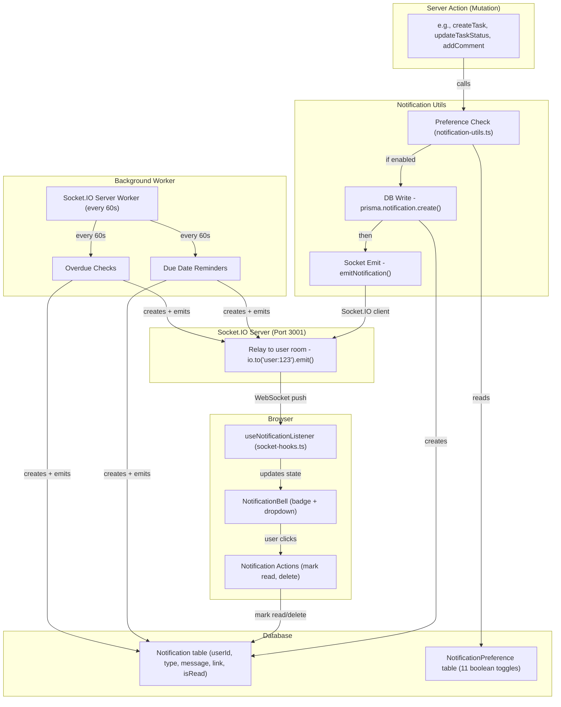
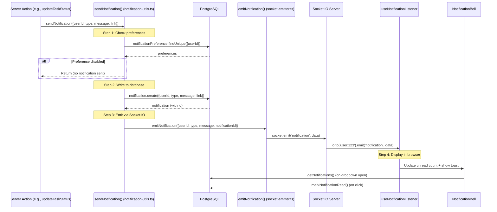
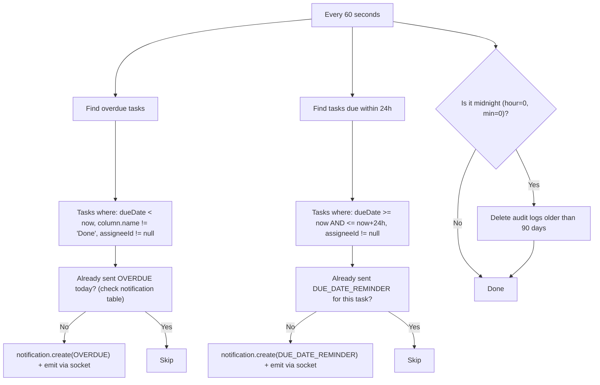
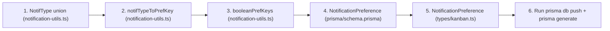

# SmartTask — Notification System

## Table of Contents

- [Overview](#overview)
- [Architecture Diagram](#architecture-diagram)
- [Notification Flow](#notification-flow)
- [Notification Types](#notification-types)
- [Preference System](#preference-system)
- [Background Worker](#background-worker)
- [Adding a New Notification Type](#adding-a-new-notification-type)
- [File Map](#file-map)

---

## Overview

SmartTask has a **dual-path notification system**: real-time delivery via Socket.IO and persistent storage in PostgreSQL. Every notification is written to the database first, then pushed via WebSocket. The browser receives it through the `useNotificationListener` hook and displays it in the bell icon badge. Users can configure which notification types they want to receive via a preference system.

---

## Architecture Diagram



---

## Notification Flow



**Critical rule:** Always call `sendNotification()` — never just emit a socket event. Without a database record, the notification won't show in the bell badge and won't persist across page refreshes.

---

## Notification Types

| Type | Trigger | Recipients |
|------|---------|-----------|
| `TASK_ASSIGNED` | Task created/updated with assignee | Assignee |
| `TASK_STATUS_CHANGED` | Task moved to different column | Assignee + Creator |
| `COMMENT_MENTION` | Comment with @name pattern | Mentioned user |
| `REVIEW_REQUESTED` | Task submitted for review | Reviewer |
| `REVIEW_COMPLETED` | Review completed (approve/reject/changes) | Task creator |
| `AUTOMATION_TRIGGERED` | Automation rule fires | Configured target (manager/assignee/creator) |
| `DUE_DATE_REMINDER` | Background worker: task due within 24h | Assignee |
| `OVERDUE` | Background worker: task past due date | Assignee |
| `NEW_USER_SIGNUP` | New user signs up or admin creates user | All admins |
| `BOARD_MEMBER_ADDED` | Member added to board | Added user |
| `BOARD_MEMBER_REMOVED` | Member removed from board | Removed user |

---

## Preference System

```mermaid
flowchart TD
    INPUT["sendNotification({userId: 'u1', type: 'TASK_ASSIGNED', message: '...'})"]

    LOOKUP["notifTypeToPrefKey['TASK_ASSIGNED'] -> 'taskAssigned'"]

    CHECK_BOOLEAN{"booleanPrefKeys has 'taskAssigned'?"}

    FETCH["notificationPreference.findUnique({userId: 'u1'})"]

    EVAL{"prefs['taskAssigned'] === false?"}

    SKIP["Skip notification (user opted out)"]

    CREATE["notification.create()"]

    INPUT --> LOOKUP --> CHECK_BOOLEAN
    CHECK_BOOLEAN -->|Yes| FETCH --> EVAL
    CHECK_BOOLEAN -->|No (unmapped type)| CREATE
    EVAL -->|"=== false"| SKIP
    EVAL -->|"!== false"| CREATE
```

### Preference Fields (NotificationPreference model)

| Field | Default | Maps From |
|-------|---------|-----------|
| `taskAssigned` | true | `TASK_ASSIGNED` |
| `statusChanged` | true | `TASK_STATUS_CHANGED` |
| `commentMention` | true | `COMMENT_MENTION` |
| `reviewRequested` | true | `REVIEW_REQUESTED` |
| `reviewCompleted` | true | `REVIEW_COMPLETED` |
| `automationTriggered` | true | `AUTOMATION_TRIGGERED` |
| `dueDateReminder` | true | `DUE_DATE_REMINDER` |
| `overdueReminder` | true | `OVERDUE` |
| `newUserSignup` | true | `NEW_USER_SIGNUP` |
| `boardMemberAdded` | true | `BOARD_MEMBER_ADDED` |
| `boardMemberRemoved` | true | `BOARD_MEMBER_REMOVED` |
| `emailEnabled` | false | (future use) |
| `pushEnabled` | false | (future use) |

Non-boolean fields (`id`, `userId`, `emailEnabled`, `pushEnabled`, `createdAt`, `updatedAt`) are excluded from the boolean preference mapping.

---

## Background Worker

The Socket.IO server runs a background worker every **60 seconds** that:



**Deduplication:**
- Overdue: Checks if an OVERDUE notification was already sent today for this task
- Due date: Checks if any DUE_DATE_REMINDER exists for this task (ever — uses task ID in message)
- Both use `findFirst` on the Notification table

---

## Adding a New Notification Type

To add a new notification type (e.g., `TASK_DELETED`), you must update **5 locations**:



### Step-by-Step

1. **`utils/notification-utils.ts`** — Add to `NotifType` union:
   ```typescript
   | 'TASK_DELETED'
   ```

2. **`utils/notification-utils.ts`** — Add to `notifTypeToPrefKey`:
   ```typescript
   TASK_DELETED: 'taskDeleted',
   ```

3. **`utils/notification-utils.ts`** — Add to `booleanPrefKeys`:
   ```typescript
   'taskDeleted',
   ```

4. **`prisma/schema.prisma`** — Add field to `NotificationPreference` model:
   ```prisma
   taskDeleted Boolean @default(true)
   ```

5. **`types/kanban.ts`** — Add to `NotificationPreference` interface:
   ```typescript
   taskDeleted: boolean;
   ```

6. **Run** `npx prisma db push && npx prisma generate`

---

## File Map

| File | Responsibility |
|------|---------------|
| `utils/notification-utils.ts` | `sendNotification()`, preference check, background check functions, `NotifType` definition |
| `utils/socket-emitter.ts` | `emitNotification()` — Socket.IO client that sends to standalone server |
| `actions/notification-actions.ts` | Server actions: get, mark read, mark all read, delete |
| `actions/notification-preferences-actions.ts` | Server actions: get/update preferences |
| `components/notification-bell.tsx` | Bell icon with unread count, dropdown with notification list, `useNotificationListener` |
| `src/socket/server.ts` | Background worker (overdue/due checks every 60s, audit log cleanup at midnight) |
| `app/api/notifications/check/route.ts` | POST endpoint to manually trigger notification checks |
| `app/profile/notifications/page.tsx` | Notification preferences UI |
