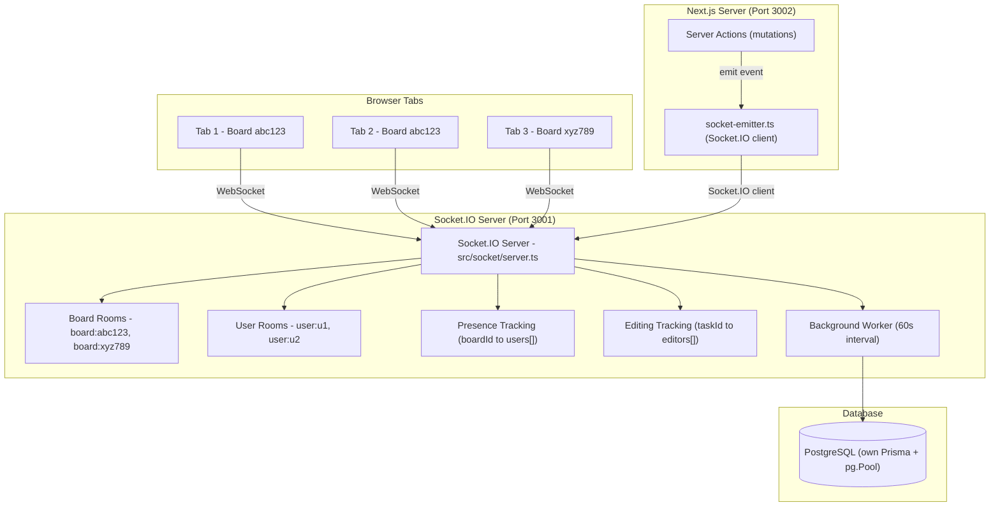
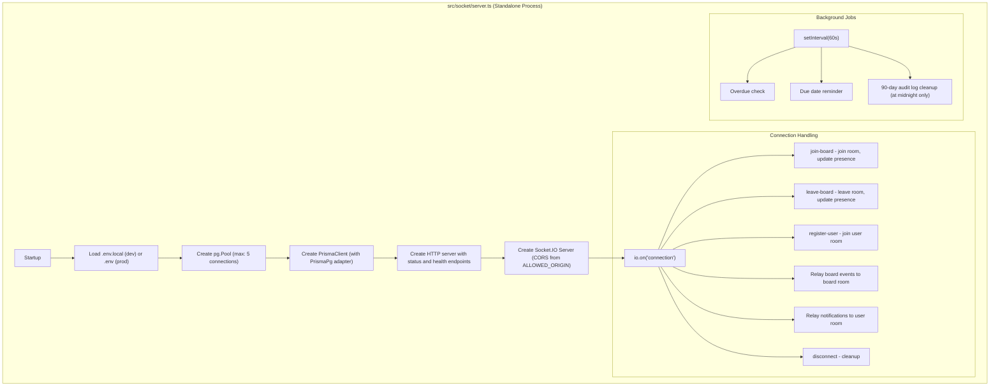
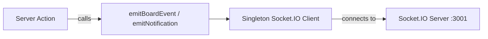
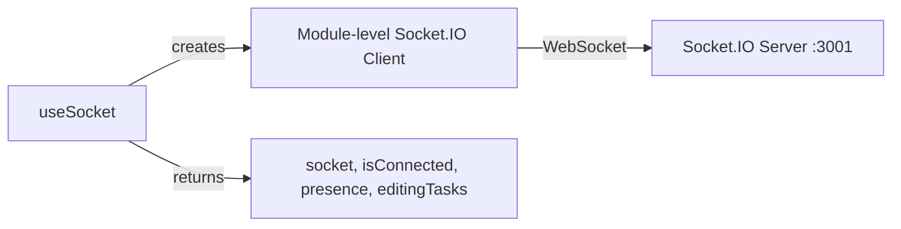
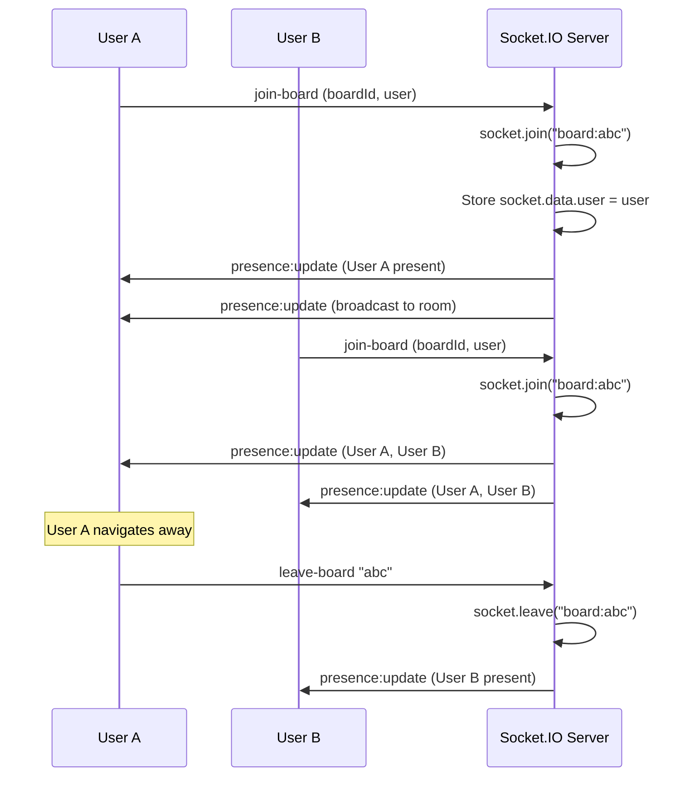
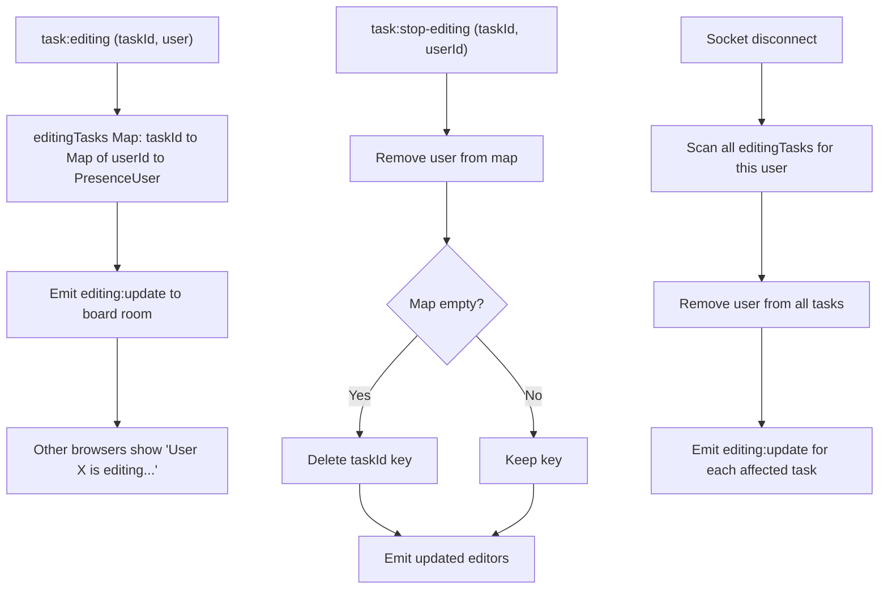
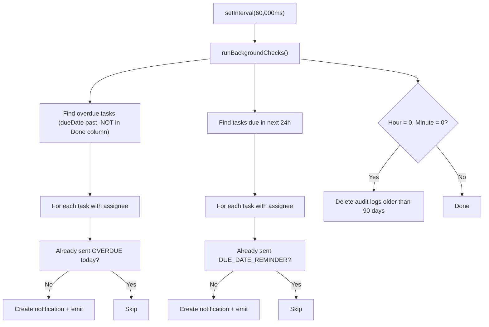
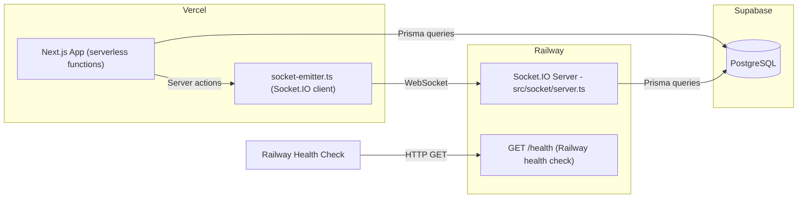

# SmartTask — Real-Time System (Socket.IO)

## Table of Contents

- [Overview](#overview)
- [Architecture Diagram](#architecture-diagram)
- [Server Architecture](#server-architecture)
- [Client Architecture](#client-architecture)
- [Board Rooms & Presence](#board-rooms--presence)
- [Event Reference](#event-reference)
- [Editing Indicators](#editing-indicators)
- [Background Worker](#background-worker)
- [Production Deployment](#production-deployment)
- [File Map](#file-map)

---

## Overview

SmartTask uses a **standalone Socket.IO server** running on a separate process (port 3001) from the Next.js app (port 3002). This is necessary because Vercel's serverless environment cannot maintain persistent WebSocket connections. The socket server is **self-contained**: it has its own Prisma client, its own pg.Pool, and does NOT import from any `@/` paths.

---

## Architecture Diagram



---

## Server Architecture



### Key Startup Details

- **Port selection:** `process.env.PORT` → `process.env.SOCKET_PORT` → `3001` (Railway auto-injects PORT)
- **CORS:** Reads `ALLOWED_ORIGIN` (comma-separated), defaults to `['*']`
- **SSL:** Auto-detects Supabase URLs and adds `ssl: { rejectUnauthorized: false }`
- **Pool size:** 5 connections (vs 20 in the Next.js Prisma client)
- **Health endpoint:** `GET /health` returns `{"status":"ok","uptime":...}` — required for Railway health checks

---

## Client Architecture

There are **two Socket.IO clients** in the system:

### 1. Server-side emitter (`utils/socket-emitter.ts`)



- Used by server actions to emit events after database commits
- **Lazy singleton** — created on first use
- Connects to `NEXT_PUBLIC_SOCKET_URL` (default `http://localhost:3001`)
- Uses both `websocket` and `polling` transports

### 2. Browser hooks (`components/kanban/socket-hooks.ts`)



- **Module-level singleton** — one connection shared across all hook instances
- `useMemo` for user prop to prevent infinite re-renders
- Manages board room join/leave lifecycle
- Cleanup on unmount via ref tracking

---

## Board Rooms & Presence



### Presence Tracking

The server maintains presence by scanning all sockets in a board room on every join/leave/disconnect:

```typescript
function getUsersInBoard(boardId: string) {
  const roomName = `board:${boardId}`
  const sockets = io.sockets.adapter.rooms.get(roomName)
  const users = new Map()
  for (const socketId of sockets) {
    const s = io.sockets.sockets.get(socketId)
    if (s?.data.user) users.set(s.data.user.id, s.data.user)
  }
  return Array.from(users.values())
}
```

Users are deduplicated by ID (same user in multiple tabs counts once).

---

## Event Reference

### Board Events (server action → emitter → server → broadcast)

| Event | Payload | Emitted By |
|-------|---------|-----------|
| `task:created` | `{boardId, task}` | `createTask()` |
| `task:updated` | `{boardId, taskId, task?}` | `updateTask()`, comment/checklist/attachment ops |
| `task:moved` | `{boardId, taskId, newColumnId, oldColumnId, task}` | `updateTaskStatus()` |
| `task:deleted` | `{boardId, taskId}` | `deleteTask()` |
| `column:created` | `{boardId, columnId, column?}` | `createColumn()` |
| `column:updated` | `{boardId, columnId}` | `updateColumn()`, `updateColumnWipLimit()` |
| `column:deleted` | `{boardId, columnId}` | `deleteColumn()` |
| `columns:reordered` | `{boardId, columnIds}` | `reorderColumns()` |
| `board:updated` | `{boardId, name}` | `updateBoard()` |
| `board:deleted` | `{boardId}` | `deleteBoard()` |
| `board:member_added` | `{boardId, userId}` | `addBoardMember()` |
| `board:member_removed` | `{boardId, userId}` | `removeBoardMember()` |
| `tag:created` | `{boardId, tagId}` | `createTag()` |
| `tag:deleted` | `{boardId, tagId}` | `deleteTag()` |

### Notification Events

| Event | Payload | Direction |
|-------|---------|-----------|
| `notification` | `{userId, type, message, link, notificationId}` | Emitter → Server → User room |
| `register-user` | `userId` (string) | Browser → Server |

### Presence Events

| Event | Payload | Direction |
|-------|---------|-----------|
| `join-board` | `{boardId, user: {id, name, image}}` | Browser → Server |
| `leave-board` | `boardId` (string) | Browser → Server |
| `presence:update` | `PresenceUser[]` | Server → Board room |

### Editing Events

| Event | Payload | Direction |
|-------|---------|-----------|
| `task:editing` | `{boardId, taskId, user}` | Browser → Server → Board room |
| `task:stop-editing` | `{boardId, taskId, userId}` | Browser → Server → Board room |
| `editing:update` | `{taskId, editors: PresenceUser[]}` | Server → Board room |

---

## Editing Indicators

The server tracks who is editing which task in memory:



---

## Background Worker



The worker runs inline on the Socket.IO server process. No external cron service needed.

---

## Production Deployment



**Railway configuration:**
- `railway.toml` sets `NIXPACKS_NODE_VERSION=22`
- Railway auto-injects `PORT` env var — the server reads it first
- Do NOT manually set `PORT` in Railway env vars
- `/health` endpoint is required for Railway to mark deployment as healthy

---

## File Map

| File | Role |
|------|------|
| `src/socket/server.ts` | Standalone Socket.IO server (own Prisma, own pg pool, background worker) |
| `utils/socket-emitter.ts` | Socket.IO **client** used by server actions to emit events |
| `components/kanban/socket-hooks.ts` | Browser hooks: `useSocket`, `useBoardEvents`, `useNotificationListener`, `emitTaskMoved/Created/Updated/Deleted` |
| `hooks/use-kanban-board.ts` | Consumes socket events for optimistic board state updates |
| `components/notification-bell.tsx` | Uses `useNotificationListener` for real-time badge updates |
