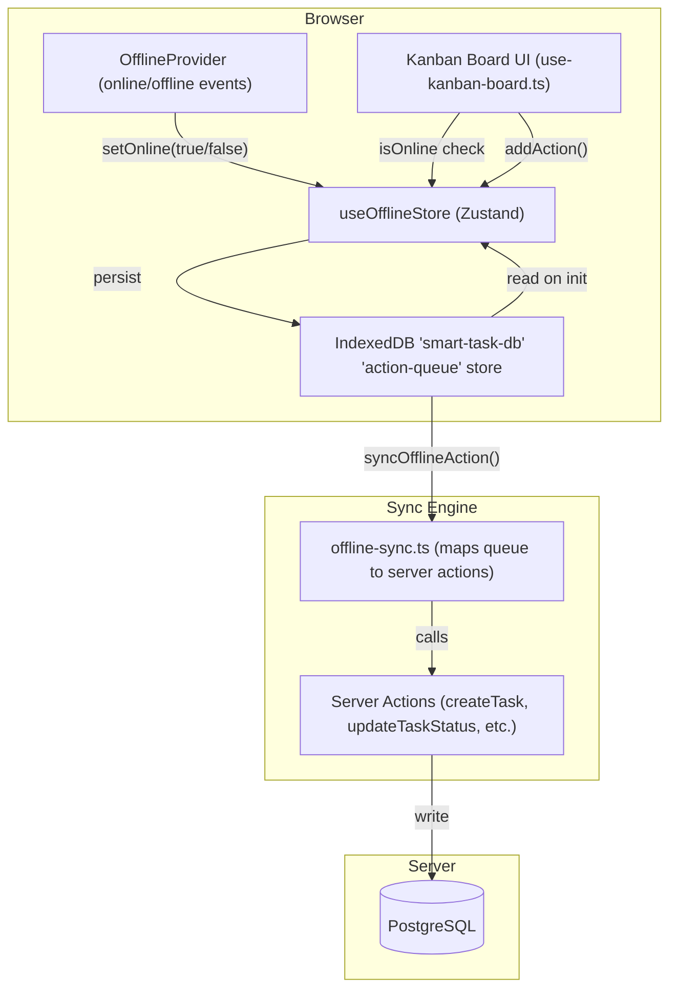
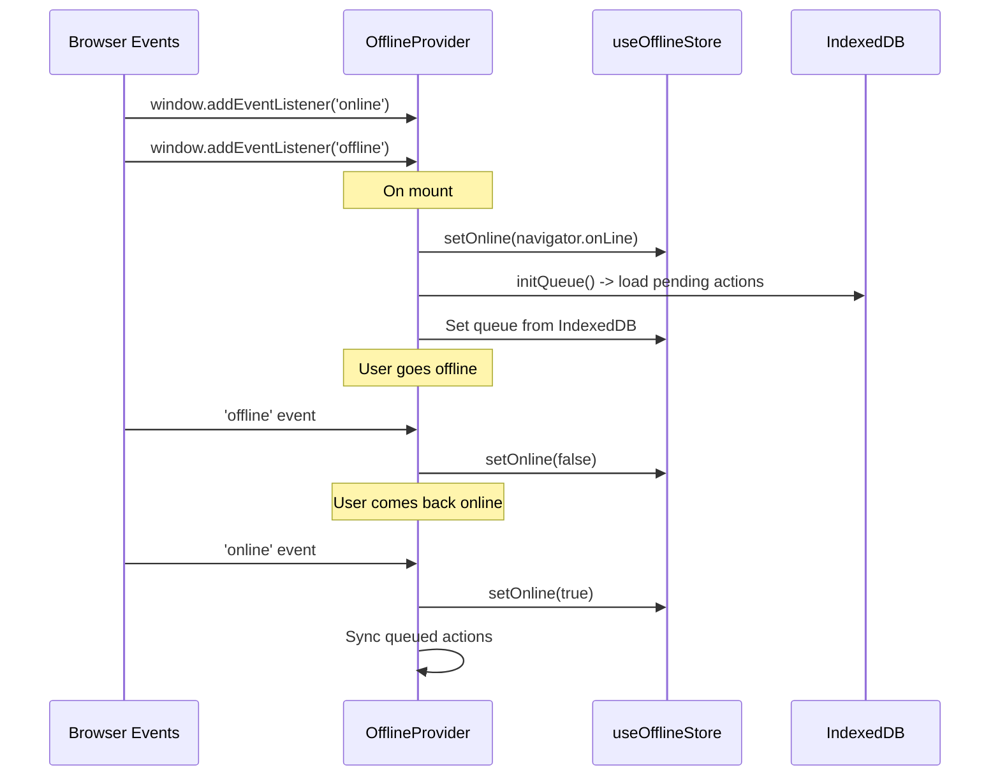
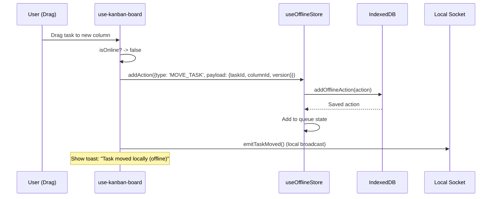
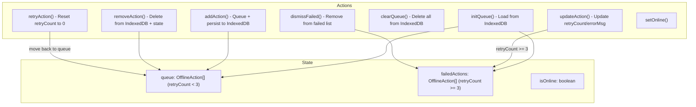
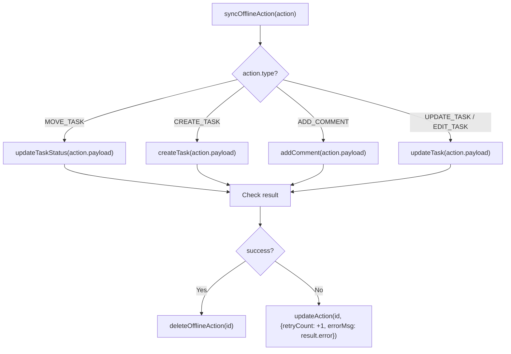
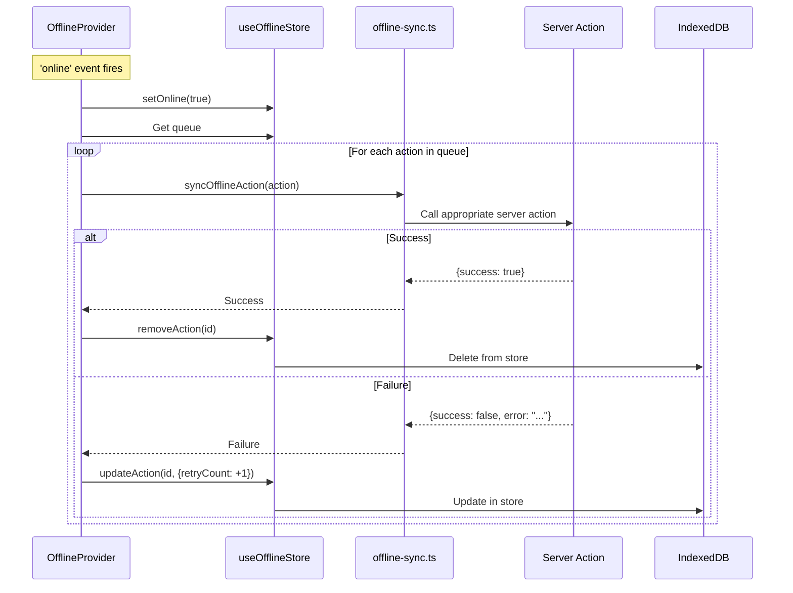
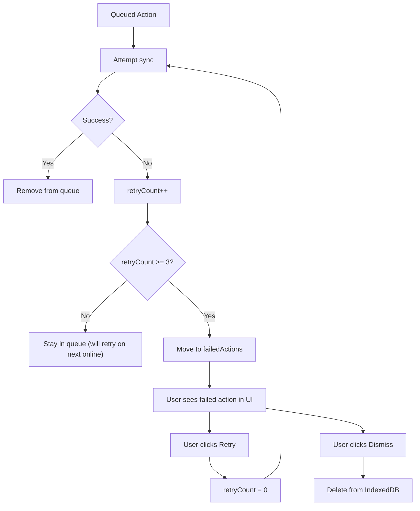

# SmartTask — Offline Queue System

## Table of Contents

- [Overview](#overview)
- [Architecture Diagram](#architecture-diagram)
- [Offline Detection](#offline-detection)
- [Action Queue Flow](#action-queue-flow)
- [Zustand Store](#zustand-store)
- [Sync on Reconnect](#sync-on-reconnect)
- [Retry & Failure Handling](#retry--failure-handling)
- [File Map](#file-map)

---

## Overview

SmartTask supports **offline-first task operations**. When the browser loses connectivity, mutations (move task, create task, edit task, add comment) are queued in **IndexedDB** and replayed when connectivity returns. The system uses a Zustand store for reactive UI state and an OfflineProvider component for online/offline detection.

---

## Architecture Diagram



---

## Offline Detection



---

## Action Queue Flow

### Queuing a Mutation (Offline)



### Supported Action Types

| Type | Payload | Server Action |
|------|---------|--------------|
| `MOVE_TASK` | `{taskId, columnId, statusName, version}` | `updateTaskStatus()` |
| `CREATE_TASK` | `{title, columnId, priority, ...}` | `createTask()` |
| `UPDATE_TASK` / `EDIT_TASK` | `{id, title?, description?, ...}` | `updateTask()` |
| `ADD_COMMENT` | `{taskId, content}` | `addComment()` |

### OfflineAction Schema

```typescript
interface OfflineAction {
  id: string          // crypto.randomUUID()
  type: "CREATE_TASK" | "MOVE_TASK" | "EDIT_TASK" | "ADD_COMMENT" | "UPDATE_TASK"
  payload: any        // Action-specific data
  timestamp: number   // Date.now()
  retryCount?: number // Incremented on retry failure
  errorMsg?: string   // Last error message
}
```

---

## Zustand Store

**File:** `lib/store/use-offline-store.ts`



The store maintains two lists:
- **queue**: Actions with `retryCount < 3` (pending retry)
- **failedActions**: Actions with `retryCount ≥ 3` (permanently failed, user must dismiss or retry manually)

---

## Sync on Reconnect

**File:** `lib/offline-sync.ts`



### Sync Flow



---

## Retry & Failure Handling



**Max retries:** 3 attempts before moving to `failedActions`. Users can manually retry or dismiss failed actions.

---

## File Map

| File | Responsibility |
|------|---------------|
| `lib/offline-db.ts` | IndexedDB wrapper: add/get/delete/update/clear actions |
| `lib/store/use-offline-store.ts` | Zustand store: queue state, online status, retry/dismiss logic |
| `lib/offline-sync.ts` | Maps queue action types to server action calls |
| `components/providers/offline-provider.tsx` | React provider: online/offline event listeners, triggers sync |
| `hooks/use-kanban-board.ts` | Checks `isOnline` before server calls, queues when offline |
