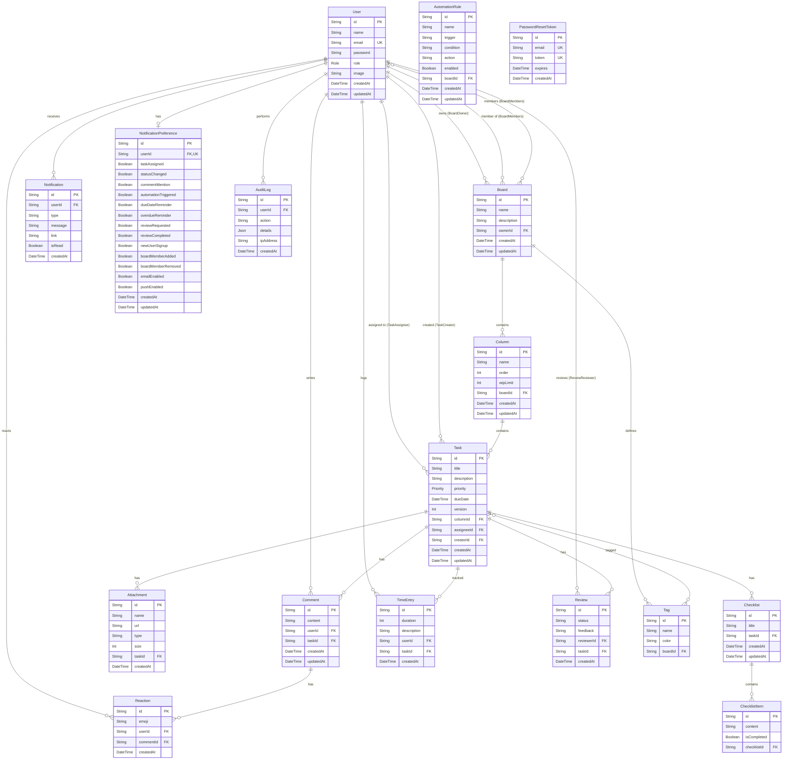

# SmartTask — Database Schema

## Table of Contents

- [Overview](#overview)
- [ERD](#erd)
- [Enums](#enums)
- [Models](#models)
  - [User](#user)
  - [Board](#board)
  - [Column](#column)
  - [Task](#task)
  - [Comment](#comment)
  - [Reaction](#reaction)
  - [Attachment](#attachment)
  - [Checklist / ChecklistItem](#checklist--checklistitem)
  - [TimeEntry](#timeentry)
  - [Review](#review)
  - [Tag](#tag)
  - [Notification](#notification)
  - [NotificationPreference](#notificationpreference)
  - [AuditLog](#auditlog)
  - [AutomationRule](#automationrule)
  - [PasswordResetToken](#passwordresettoken)
- [Relationships Summary](#relationships-summary)
- [Cascade Deletes](#cascade-deletes)
- [Indexes & Uniques](#indexes--uniques)
- [File Map](#file-map)

---

## Overview

SmartTask uses **PostgreSQL** via **Prisma v7** with the `@prisma/adapter-pg` driver adapter. The schema has **16 models** and **2 enums**. Prisma Client is generated to `generated/prisma` (imported as `'../generated/prisma'` from `lib/prisma.ts`). Schema changes use `db push` (not migrations).

---

## ERD



---

## Enums

### `Role`

| Value | Description |
|-------|-------------|
| `ADMIN` | Full system access, manages all boards/users |
| `MANAGER` | Can create boards, manage board members, approve/review tasks |
| `MEMBER` | Can collaborate on boards they belong to, assign tasks to self |

### `Priority`

| Value | Description |
|-------|-------------|
| `LOW` | Low priority task |
| `MEDIUM` | Default priority |
| `HIGH` | High priority |
| `URGENT` | Critical/urgent task |

---

## Models

### User

Central identity model. Links to every major entity via ownership, assignment, or activity.

| Field | Type | Attributes |
|-------|------|-----------|
| `id` | `String` | `@id @default(cuid())` |
| `name` | `String?` | Optional display name |
| `email` | `String` | `@unique` — used for login |
| `password` | `String` | bcrypt-hashed |
| `role` | `Role` | `@default(MEMBER)` |
| `image` | `String?` | Avatar URL |
| `createdAt` | `DateTime` | `@default(now())` |
| `updatedAt` | `DateTime` | `@updatedAt` |

**Relations:** `ownedBoards`, `boards` (membership m:n), `tasks` (assignee), `createdTasks`, `comments`, `timeEntries`, `reviews`, `reactions`, `notifications`, `auditLogs`, `notificationPreferences` (1:1)

---

### Board

Top-level organizational unit. Has columns, tags, and member users.

| Field | Type | Attributes |
|-------|------|-----------|
| `id` | `String` | `@id @default(cuid())` |
| `name` | `String` | Max 50 chars (schema validation) |
| `description` | `String?` | Max 255 chars (schema validation) |
| `ownerId` | `String` | FK → `User.id`, cascade delete |
| `createdAt` | `DateTime` | `@default(now())` |
| `updatedAt` | `DateTime` | `@updatedAt` |

**Relations:** `owner` (User), `columns` (1:n), `tags` (1:n), `members` (m:n via implicit join table)

---

### Column

Ordered swim lane within a board. Supports WIP limits.

| Field | Type | Attributes |
|-------|------|-----------|
| `id` | `String` | `@id @default(cuid())` |
| `name` | `String` | e.g. "To Do", "In Progress", "Done" |
| `order` | `Int` | `@default(0)` — sort position |
| `wipLimit` | `Int` | `@default(0)` — 0 = unlimited |
| `boardId` | `String` | FK → `Board.id`, cascade delete |
| `createdAt` | `DateTime` | `@default(now())` |
| `updatedAt` | `DateTime` | `@updatedAt` |

**Relations:** `board` (Board), `tasks` (1:n)

---

### Task

Core work item. Has optimistic concurrency via `version` field.

| Field | Type | Attributes |
|-------|------|-----------|
| `id` | `String` | `@id @default(cuid())` |
| `title` | `String` | Max 100 chars (schema validation) |
| `description` | `String?` | Max 1000 chars (schema validation) |
| `priority` | `Priority` | `@default(MEDIUM)` |
| `dueDate` | `DateTime?` | Deadline |
| `version` | `Int` | `@default(1)` — incremented on every update for conflict detection |
| `columnId` | `String` | FK → `Column.id`, cascade delete |
| `assigneeId` | `String?` | FK → `User.id` (nullable = unassigned) |
| `creatorId` | `String` | FK → `User.id` — who created the task |
| `createdAt` | `DateTime` | `@default(now())` |
| `updatedAt` | `DateTime` | `@updatedAt` |

**Relations:** `column` (Column), `assignee` (User, nullable), `creator` (User), `comments` (1:n), `attachments` (1:n), `checklists` (1:n), `timeEntries` (1:n), `reviews` (1:n), `tags` (m:n)

**Version Conflict Detection:** Clients send `version` on update. If `clientVersion !== serverVersion`, the server returns a conflict error. Pass `version: undefined` to bypass (used by conflict resolution dialog).

---

### Comment

Threaded discussion on a task. Editable within 5 minutes by non-admin/manager users.

| Field | Type | Attributes |
|-------|------|-----------|
| `id` | `String` | `@id @default(cuid())` |
| `content` | `String` | Comment text |
| `userId` | `String` | FK → `User.id`, cascade delete |
| `taskId` | `String` | FK → `Task.id`, cascade delete |
| `createdAt` | `DateTime` | `@default(now())` |
| `updatedAt` | `DateTime` | `@updatedAt` |

**Relations:** `user` (User), `task` (Task), `reactions` (1:n)

---

### Reaction

Emoji reaction on a comment. One emoji per user per comment (unique constraint).

| Field | Type | Attributes |
|-------|------|-----------|
| `id` | `String` | `@id @default(cuid())` |
| `emoji` | `String` | Emoji character |
| `userId` | `String` | FK → `User.id`, cascade delete |
| `commentId` | `String` | FK → `Comment.id`, cascade delete |
| `createdAt` | `DateTime` | `@default(now())` |

**Unique:** `@@unique([userId, commentId, emoji])` — prevents duplicate reactions.

---

### Attachment

File attached to a task. Stored on the filesystem or cloud storage.

| Field | Type | Attributes |
|-------|------|-----------|
| `id` | `String` | `@id @default(cuid())` |
| `name` | `String` | Original filename |
| `url` | `String` | File URL/path |
| `type` | `String` | MIME type |
| `size` | `Int` | File size in bytes |
| `taskId` | `String` | FK → `Task.id`, cascade delete |
| `createdAt` | `DateTime` | `@default(now())` |

---

### Checklist / ChecklistItem

Two-level checklist structure. A Task has many Checklists, each Checklist has many ChecklistItems.

**Checklist:**

| Field | Type | Attributes |
|-------|------|-----------|
| `id` | `String` | `@id @default(cuid())` |
| `title` | `String` | Checklist title |
| `taskId` | `String` | FK → `Task.id`, cascade delete |
| `createdAt` | `DateTime` | `@default(now())` |
| `updatedAt` | `DateTime` | `@updatedAt` |

**ChecklistItem:**

| Field | Type | Attributes |
|-------|------|-----------|
| `id` | `String` | `@id @default(cuid())` |
| `content` | `String` | Item text |
| `isCompleted` | `Boolean` | `@default(false)` |
| `checklistId` | `String` | FK → `Checklist.id`, cascade delete |

---

### TimeEntry

Tracks time spent on a task by a user.

| Field | Type | Attributes |
|-------|------|-----------|
| `id` | `String` | `@id @default(cuid())` |
| `duration` | `Int` | Duration in seconds |
| `description` | `String?` | Optional note |
| `userId` | `String` | FK → `User.id`, cascade delete |
| `taskId` | `String` | FK → `Task.id`, cascade delete |
| `createdAt` | `DateTime` | `@default(now())` |

---

### Review

Review request on a task. Status is a string (not enum): `PENDING`, `APPROVED`, `CHANGES_REQUESTED`, `REJECTED`.

| Field | Type | Attributes |
|-------|------|-----------|
| `id` | `String` | `@id @default(cuid())` |
| `status` | `String` | `PENDING` / `APPROVED` / `CHANGES_REQUESTED` / `REJECTED` |
| `feedback` | `String?` | Reviewer feedback |
| `reviewerId` | `String` | FK → `User.id` |
| `taskId` | `String` | FK → `Task.id`, cascade delete |
| `createdAt` | `DateTime` | `@default(now())` |

**Auto-move Logic:** `APPROVED` → task moves to "Done", `CHANGES_REQUESTED` → "In Progress", `REJECTED` → "To Do" (case-insensitive column name match).

---

### Tag

Labels for tasks. Board-scoped (a tag belongs to a board).

| Field | Type | Attributes |
|-------|------|-----------|
| `id` | `String` | `@id @default(cuid())` |
| `name` | `String` | Tag label |
| `color` | `String` | Hex color |
| `boardId` | `String?` | FK → `Board.id` (nullable for global tags) |

**Relations:** `board` (Board, nullable), `tasks` (m:n via implicit join table)

---

### Notification

Push notification to a user. Persisted for bell icon badge and history.

| Field | Type | Attributes |
|-------|------|-----------|
| `id` | `String` | `@id @default(cuid())` |
| `userId` | `String` | FK → `User.id`, cascade delete |
| `type` | `String` | Notification type (e.g. `TASK_ASSIGNED`, `COMMENT_MENTION`) |
| `message` | `String` | Human-readable text |
| `link` | `String?` | Click-through URL |
| `isRead` | `Boolean` | `@default(false)` |
| `createdAt` | `DateTime` | `@default(now())` |

---

### NotificationPreference

Per-user notification opt-in/out settings. One-to-one with User.

| Field | Type | Default |
|-------|------|---------|
| `id` | `String` | `@id @default(cuid())` |
| `userId` | `String` | `@unique`, FK → `User.id`, cascade delete |
| `taskAssigned` | `Boolean` | `true` |
| `statusChanged` | `Boolean` | `true` |
| `commentMention` | `Boolean` | `true` |
| `automationTriggered` | `Boolean` | `true` |
| `dueDateReminder` | `Boolean` | `true` |
| `overdueReminder` | `Boolean` | `true` |
| `reviewRequested` | `Boolean` | `true` |
| `reviewCompleted` | `Boolean` | `true` |
| `newUserSignup` | `Boolean` | `true` |
| `boardMemberAdded` | `Boolean` | `true` |
| `boardMemberRemoved` | `Boolean` | `true` |
| `emailEnabled` | `Boolean` | `false` |
| `pushEnabled` | `Boolean` | `false` |
| `createdAt` | `DateTime` | `@default(now())` |
| `updatedAt` | `DateTime` | `@updatedAt` |

11 boolean notification type toggles + 2 delivery channel toggles.

---

### AuditLog

Append-only log of all mutations. Used for undo support and compliance.

| Field | Type | Attributes |
|-------|------|-----------|
| `id` | `String` | `@id @default(cuid())` |
| `userId` | `String` | FK → `User.id`, cascade delete — `'system'` for automation |
| `action` | `String` | Action type (e.g. `CREATE_TASK`, `MOVE_TASK`, `AUTOMATION_EXECUTED`) |
| `details` | `Json` | Structured payload — NOT a string, use helpers to format |
| `ipAddress` | `String?` | Auto-injected by `createAuditLog()` |
| `createdAt` | `DateTime` | `@default(now())` |

**Background Cleanup:** Socket server deletes audit logs older than 90 days at midnight.

---

### AutomationRule

User-defined automation with trigger/condition/action pattern.

| Field | Type | Attributes |
|-------|------|-----------|
| `id` | `String` | `@id @default(cuid())` |
| `name` | `String` | Human-readable name |
| `trigger` | `String` | `TASK_CREATED` / `TASK_MOVED` / `TASK_UPDATED` / `TASK_ASSIGNED` |
| `condition` | `String?` | Optional filter (e.g. `priority=HIGH`, `column=Done`) |
| `action` | `String` | Action type + params (e.g. `SEND_NOTIFICATION:email:manager`, `MOVE_TASK:column:Done`) |
| `enabled` | `Boolean` | `@default(true)` |
| `boardId` | `String?` | Board scope — `null` = system-wide |
| `createdAt` | `DateTime` | `@default(now())` |
| `updatedAt` | `DateTime` | `@updatedAt` |

**Note:** `boardId` is nullable and has **no FK constraint** — it's a loose reference, not a relation.

---

### PasswordResetToken

Self-service password reset tokens with expiry.

| Field | Type | Attributes |
|-------|------|-----------|
| `id` | `String` | `@id @default(cuid())` |
| `email` | `String` | `@unique` |
| `token` | `String` | `@unique` |
| `expires` | `DateTime` | Expiry timestamp |
| `createdAt` | `DateTime` | `@default(now())` |

**Unique:** `@@unique([email, token])`

---

## Relationships Summary

```mermaid
graph LR
    subgraph "Core"
        User --> Board : "owns / member"
        Board --> Column : "1:N"
        Column --> Task : "1:N"
    end

    subgraph "Task Sub-systems"
        Task --> Comment : "1:N"
        Task --> Attachment : "1:N"
        Task --> Checklist --> ChecklistItem : "1:N"
        Task --> TimeEntry : "1:N"
        Task --> Review : "1:N"
        Task --- Tag : "M:N"
    end

    subgraph "User Activity"
        User --> Comment : "writes"
        User --> Reaction : "reacts"
        Comment --> Reaction : "1:N"
    end

    subgraph "Notification System"
        User --> Notification : "receives"
        User --> NotificationPreference : "1:1"
    end

    subgraph "System"
        User --> AuditLog : "performs"
        AutomationRule -.-> Board : "scoped to (no FK)"
    end

    subgraph "Auth"
        PasswordResetToken
    end
```

---

## Cascade Deletes

When a record is deleted, cascades clean up dependent records:

| Parent | Cascade Target |
|--------|---------------|
| `User` | `AuditLog`, `Board` (owned), `Comment`, `Notification`, `Task` (assigned/created), `TimeEntry`, `Review`, `Reaction`, `NotificationPreference` |
| `Board` | `Column` → (cascades further to `Task` → all task sub-entities) |
| `Column` | `Task` → `Comment`, `Attachment`, `Checklist` → `ChecklistItem`, `TimeEntry`, `Review` |
| `Task` | `Comment` → `Reaction`, `Attachment`, `Checklist` → `ChecklistItem`, `TimeEntry`, `Review` |
| `Comment` | `Reaction` |
| `Checklist` | `ChecklistItem` |

---

## Indexes & Uniques

| Model | Field(s) | Type |
|-------|----------|------|
| `User` | `email` | `@unique` |
| `Reaction` | `[userId, commentId, emoji]` | `@@unique` |
| `NotificationPreference` | `userId` | `@unique` |
| `PasswordResetToken` | `email` | `@unique` |
| `PasswordResetToken` | `token` | `@unique` |
| `PasswordResetToken` | `[email, token]` | `@@unique` |

All models use CUID (`@default(cuid())`) as primary keys.

---

## File Map

| Purpose | Path |
|---------|------|
| Prisma schema | `prisma/schema.prisma` |
| Prisma config | `prisma.config.ts` |
| DB client + adapter | `lib/prisma.ts` |
| Generated client | `generated/prisma/` (gitignored) |
| Seed data | `prisma/seed.ts` |
| DB connectivity check | `scripts/db-check.ts` |
