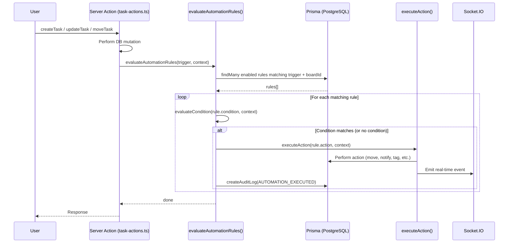
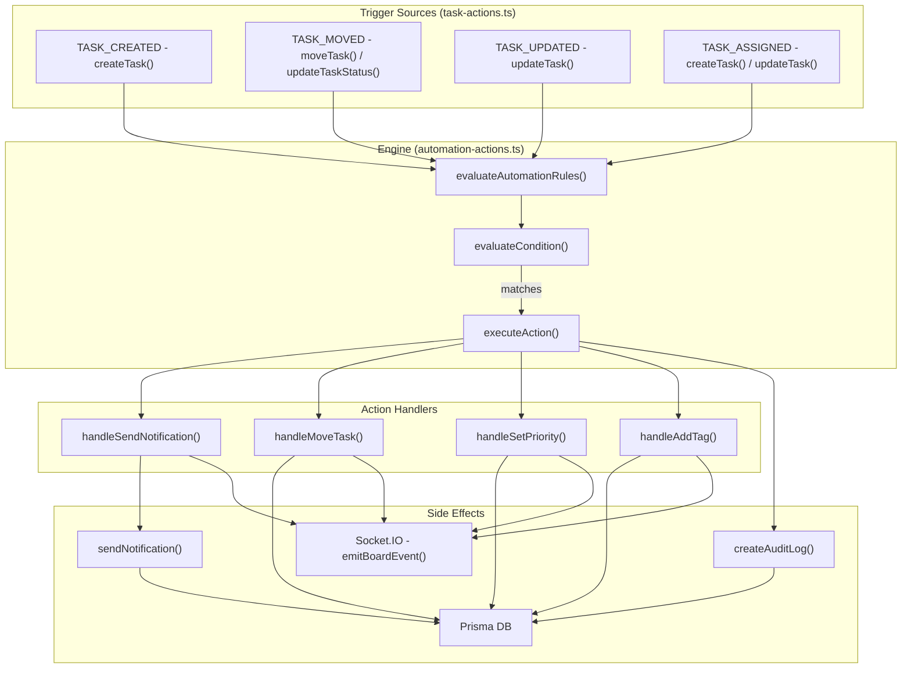
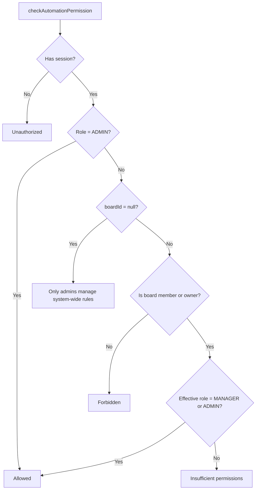

# SmartTask — Automation Engine

## Table of Contents

- [Overview](#overview)
- [Rule Evaluation Flow](#rule-evaluation-flow)
- [Architecture Diagram](#architecture-diagram)
- [Triggers](#triggers)
- [Conditions](#conditions)
- [Actions](#actions)
- [Permission Model](#permission-model)
- [CRUD Operations](#crud-operations)
- [Integration Points](#integration-points)
- [Audit Trail](#audit-trail)
- [File Map](#file-map)

---

## Overview

SmartTask has a **trigger → condition → action** automation engine. Users define rules scoped to a board (or system-wide for admins). When a task event fires, the engine evaluates all matching enabled rules and executes their actions. Every execution is audit-logged.

Rules live in the `AutomationRule` table (`prisma/schema.prisma`). Evaluation logic is in `actions/automation-actions.ts`. The engine is **synchronous** — rules run inline during server action execution, not in a background queue.

---

## Rule Evaluation Flow



---

## Architecture Diagram



---

## Triggers

Triggers are the events that cause rule evaluation. Defined as `Trigger` type in `actions/automation-actions.ts`:

| Trigger | When Fired | Source |
|---------|-----------|--------|
| `TASK_CREATED` | After `createTask()` commits to DB | `task-actions.ts:155` |
| `TASK_MOVED` | After `moveTask()` or `updateTaskStatus()` commits | `task-actions.ts:368`, `task-actions.ts:1281` |
| `TASK_UPDATED` | After `updateTask()` commits | `task-actions.ts:262` |
| `TASK_ASSIGNED` | After task creation with assignee, or after assignee change in `updateTask()` | `task-actions.ts:173`, `task-actions.ts:250` |

### TaskContext

Every trigger passes a `TaskContext` object to the engine:

```typescript
interface TaskContext {
  taskId: string
  taskTitle: string
  columnId: string
  columnName: string
  boardId: string
  priority: string
  assigneeId: string | null
  previousColumnId?: string  // only for TASK_MOVED
}
```

---

## Conditions

Conditions are optional string filters. If `null` or empty, the rule always matches when triggered.

| Condition String | Evaluates True When |
|-----------------|-------------------|
| `priority=HIGH` | Task priority is HIGH |
| `priority=URGENT` | Task priority is URGENT |
| `priority=MEDIUM` | Task priority is MEDIUM |
| `priority=LOW` | Task priority is LOW |
| `assignee=null` | Task is unassigned |
| `assignee!=null` | Task has an assignee |
| `column=In Progress` | Column name contains "progress" (case-insensitive) |
| `column=Done` | Column name contains "done" (case-insensitive) |
| `column=To Do` | Column name contains "todo" or "to do" (case-insensitive) |

Column conditions use **fuzzy matching** (`toLowerCase().includes()`) so they work regardless of exact column naming.

### Condition Evaluation Logic

```mermaid
flowchart TD
    START[Rule has condition?] -->|No| MATCH[Match]
    START -->|Yes| EVAL[evaluateCondition]
    EVAL --> LOOKUP{conditionMap has key?}
    LOOKUP -->|Yes| RUN[Run evaluator function]
    LOOKUP -->|No| DEFAULT[Match (default: true)]
    RUN -->|true| MATCH
    RUN -->|false| SKIP[Skip rule]
    EVAL -->|Exception| DEFAULT
```

If the condition string is not in the known map, or an exception occurs, the engine **defaults to matching** (fails open).

---

## Actions

Actions are encoded as strings with the format `ACTION_TYPE:params`. The `executeAction()` function splits on `:` to get the type and parameters.

### SEND_NOTIFICATION

**Format:** `SEND_NOTIFICATION:email:<email>` or `SEND_NOTIFICATION:email:manager`

| Param | Target |
|-------|--------|
| `email:manager` | Board's MANAGER member, or board owner if no manager |
| `email:assignee` | Task's assignee |
| `email:creator` | Task's creator |
| `email:<actual-email>` | Specific user (future use) |

**Side effects:** Creates `Notification` record via `sendNotification()`, emits `notification:new` socket event. Uses `AUTOMATION_TRIGGERED` notification type.

### MOVE_TASK

**Format:** `MOVE_TASK:column:<column-name>`

| Param | Target |
|-------|--------|
| `column:Done` | Moves task to column whose name contains "Done" |
| `column:In Progress` | Moves to column containing "In Progress" |
| `column:To Do` | Moves to column containing "To Do" |

Column lookup uses **case-insensitive `contains`** (`Prisma` `mode: 'insensitive'`).

**Side effects:** Updates `Task.columnId`, increments `Task.version`, emits `task:moved` socket event.

**Guard:** Does nothing if target column is same as current column.

### SET_PRIORITY

**Format:** `SET_PRIORITY:priority:<LEVEL>`

| Param | Target |
|-------|--------|
| `priority:LOW` | Sets task priority to LOW |
| `priority:MEDIUM` | Sets task priority to MEDIUM |
| `priority:HIGH` | Sets task priority to HIGH |
| `priority:URGENT` | Sets task priority to URGENT |

**Side effects:** Updates `Task.priority`, increments `Task.version`, emits `task:updated` socket event.

**Guard:** Only accepts valid priority values (`LOW`, `MEDIUM`, `HIGH`, `URGENT`).

### ADD_TAG

**Format:** `ADD_TAG:tag:<tag-name>`

Creates the tag if it doesn't exist on the board (default color `#888888`), then connects it to the task.

**Side effects:** May create `Tag` record, updates `Task.tags`, increments `Task.version`, emits `task:updated` socket event.

---

## Permission Model



| Scope | Who Can Manage |
|-------|---------------|
| System-wide (`boardId: null`) | ADMIN only |
| Board-scoped (`boardId: <id>`) | Board owner (treated as MANAGER), MANAGER role members, ADMIN |

---

## CRUD Operations

### getAutomationRules

```
getAutomationRules({ boardId? }) → ActionResult
```

Fetches rules filtered by `boardId`. If no `boardId` provided, returns system-wide rules (`boardId: null`). Requires authentication.

### createAutomationRule

```
createAutomationRule(data) → ActionResult
```

Validates with `createAutomationRuleSchema`, checks permissions, creates rule. Audit logs `CREATE_AUTOMATION_RULE`. Revalidates board page if board-scoped.

### updateAutomationRule

```
updateAutomationRule(data) → ActionResult
```

Validates with `updateAutomationRuleSchema`, checks permissions on the **existing rule's boardId** (not the new one). Audit logs `UPDATE_AUTOMATION_RULE`.

### deleteAutomationRule

```
deleteAutomationRule({ id }) → ActionResult
```

Checks permissions on existing rule, deletes. Audit logs `DELETE_AUTOMATION_RULE`.

### toggleAutomationRule

```
toggleAutomationRule({ id, enabled }) → ActionResult
```

Enable/disable toggle. Checks permissions. Audit logs `TOGGLE_AUTOMATION_RULE`.

---

## Integration Points

Where `evaluateAutomationRules()` is called in `task-actions.ts`:

| Location | Trigger | Context |
|----------|---------|---------|
| `createTask()` line 155 | `TASK_CREATED` | After task creation (if no assignee) |
| `createTask()` line 173 | `TASK_ASSIGNED` | After task creation (if assignee provided) |
| `updateTask()` line 250 | `TASK_ASSIGNED` | When assignee changes to a new value |
| `updateTask()` line 262 | `TASK_UPDATED` | After general task update |
| `updateTaskStatus()` line 368 | `TASK_MOVED` | After DnD column move |
| Review completion line 1281 | `TASK_MOVED` | After auto-move from review result |

### Important Behaviors

- **Rules run AFTER the primary DB commit** — the triggering mutation is already persisted
- **Rules run synchronously** — the server action waits for all rules to execute before responding
- **Errors are caught per-rule** — one failing rule doesn't prevent other rules from running
- **Version is incremented** by MOVE_TASK, SET_PRIORITY, and ADD_TAG actions (same as manual edits)
- **No recursion guard** — a MOVE_TASK action triggering TASK_MOVED could theoretically re-evaluate rules. In practice, column-match guards prevent infinite loops.

---

## Audit Trail

Every rule execution creates an `AuditLog` entry:

```json
{
  "userId": "system",
  "action": "AUTOMATION_EXECUTED",
  "details": {
    "ruleId": "clx...",
    "ruleName": "Auto-move urgent tasks",
    "trigger": "TASK_CREATED",
    "taskId": "clx...",
    "action": "MOVE_TASK:column:In Progress",
    "boardId": "clx..."
  }
}
```

Rule management operations (create, update, delete, toggle) are also audit-logged with the acting user's ID.

---

## File Map

| Purpose | Path |
|---------|------|
| Engine (evaluate + execute) | `actions/automation-actions.ts` |
| Trigger call sites | `actions/task-actions.ts` |
| AutomationRule model | `prisma/schema.prisma` |
| Zod schemas | `lib/schemas.ts` (`createAutomationRuleSchema`, `updateAutomationRuleSchema`) |
| Audit log helper | `lib/create-audit-log.ts` |
| Notification sender | `utils/notification-utils.ts` |
| Socket emitter | `utils/socket-emitter.ts` |
