# SmartTask — Hooks Reference

> Complete visual guide to every hook in the project, how they connect, and what they do.

---

## Table of Contents

1. [Hooks Map — Big Picture](#1-hooks-map--big-picture)
2. [Socket Hooks](#2-socket-hooks)
3. [Kanban Board Hook](#3-kanban-board-hook)
4. [Task Details Hook](#4-task-details-hook)
5. [Task Comments Hook](#5-task-comments-hook)
6. [Task Checklist Hook](#6-task-checklist-hook)
7. [Task Attachments Hook](#7-task-attachments-hook)
8. [Task Tags Hook](#8-task-tags-hook)
9. [Task Time Hook](#9-task-time-hook)
10. [Task Reviews Hook](#10-task-reviews-hook)
11. [Task Activity Hook](#11-task-activity-hook)
12. [Mobile Hook](#12-mobile-hook)
13. [Hook Dependency Graph](#13-hook-dependency-graph)
14. [Common Patterns](#14-common-patterns)

---

## 1. Hooks Map — Big Picture

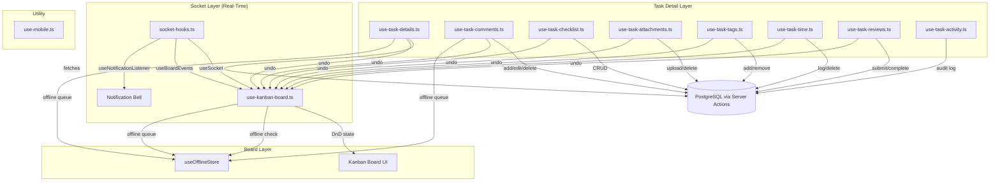

---

## 2. Socket Hooks

**File:** `components/kanban/socket-hooks.ts`

Three hooks + four emitter functions. This is the **real-time backbone** of the entire app.

### 2.1 `useSocket(boardId?, user?)`

**Purpose:** Manages the single WebSocket connection to the Socket.IO server. Tracks presence (who's viewing the board) and editing indicators (who's editing which task).

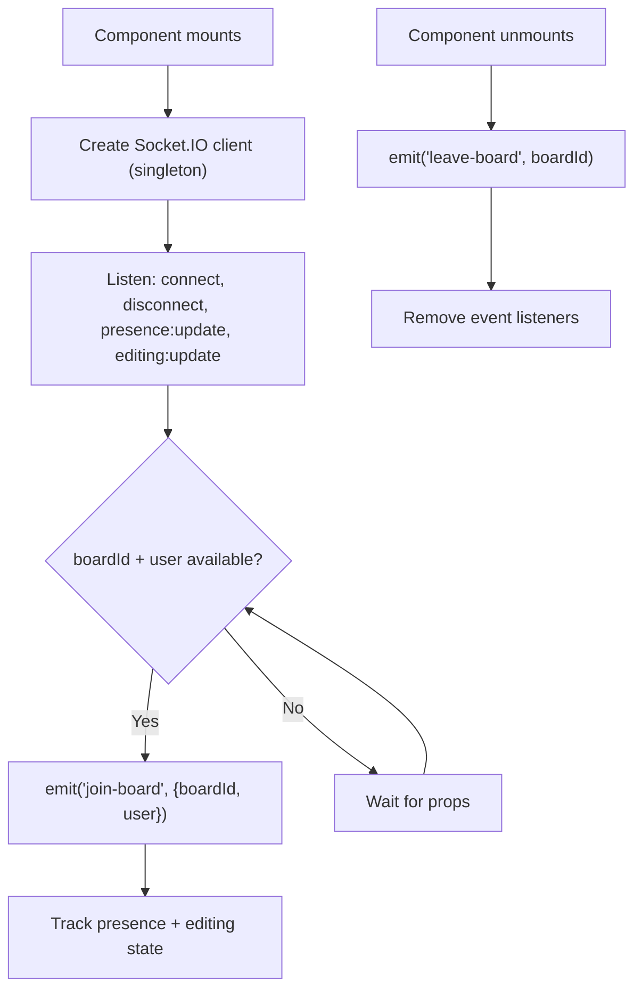

**Returns:**

| Property | Type | Description |
|----------|------|-------------|
| `socket` | `Socket` | Raw Socket.IO client instance |
| `isConnected` | `boolean` | WebSocket connection status |
| `presence` | `PresenceUser[]` | Who is currently viewing this board |
| `editingTasks` | `Record<string, PresenceUser[]>` | Who is editing which task |

**Critical detail:** Uses `useMemo` on the `user` prop to prevent infinite re-renders. The socket is a **module-level singleton** — one connection shared across all components.

### 2.2 `useBoardEvents(boardId, onEvent)`

**Purpose:** Subscribes to all board-level socket events and routes them through a single callback.

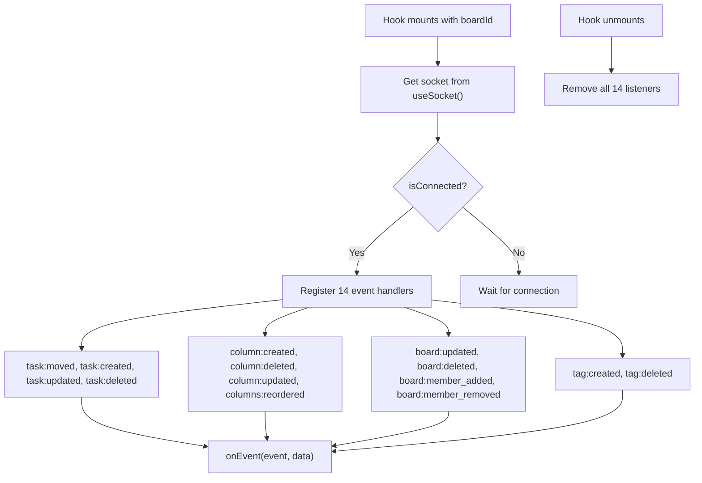

**Events handled (14 total):**

| Event | What it means |
|-------|--------------|
| `task:moved` | Someone dragged a task to a different column |
| `task:created` | New task added to the board |
| `task:updated` | Task title/description/priority changed |
| `task:deleted` | Task removed |
| `column:created` | New column added |
| `column:deleted` | Column removed |
| `column:updated` | Column name/WIP limit changed |
| `columns:reordered` | Columns rearranged |
| `board:updated` | Board name changed |
| `board:deleted` | Board deleted (redirects to /dashboard) |
| `board:member_added` | New member joined |
| `board:member_removed` | Member removed |
| `tag:created` | New tag created |
| `tag:deleted` | Tag deleted |

### 2.3 `useNotificationListener(userId, onNotification)`

**Purpose:** Registers the user in their personal notification room and listens for incoming notifications.

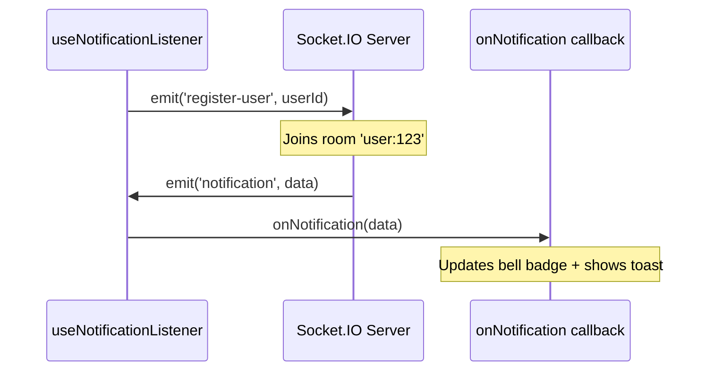

### 2.4 Emitter Functions

Standalone functions (not hooks) that emit events from the browser to the Socket.IO server:

| Function | Event | Used By |
|----------|-------|---------|
| `emitTaskMoved(boardId, data)` | `task:moved` | `use-kanban-board.ts` (offline drag) |
| `emitTaskCreated(boardId, data)` | `task:created` | — |
| `emitTaskUpdated(boardId, data)` | `task:updated` | — |
| `emitTaskDeleted(boardId, data)` | `task:deleted` | — |
| `getSocket()` | — | All emitters (lazy singleton) |

---

## 3. Kanban Board Hook

**File:** `hooks/use-kanban-board.ts`

**Purpose:** The **central state machine** for the Kanban board. Handles drag-and-drop, optimistic updates, conflict resolution, undo, and offline support.

### Architecture

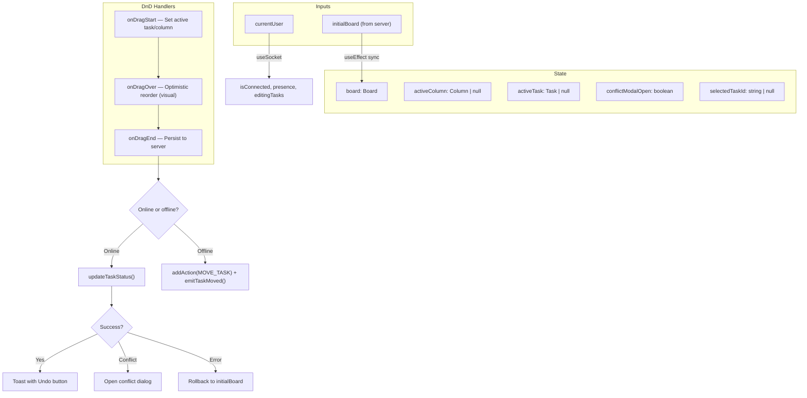

### Drag-and-Drop Flow

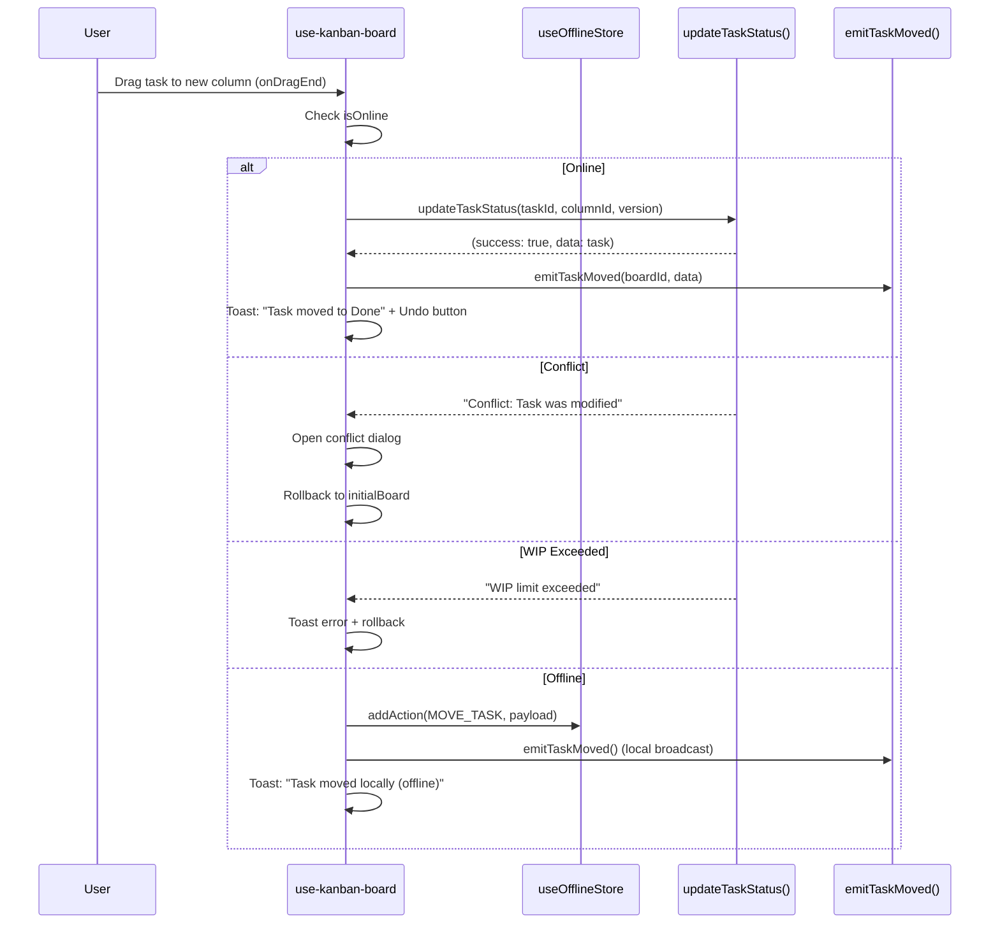

### Conflict Resolution

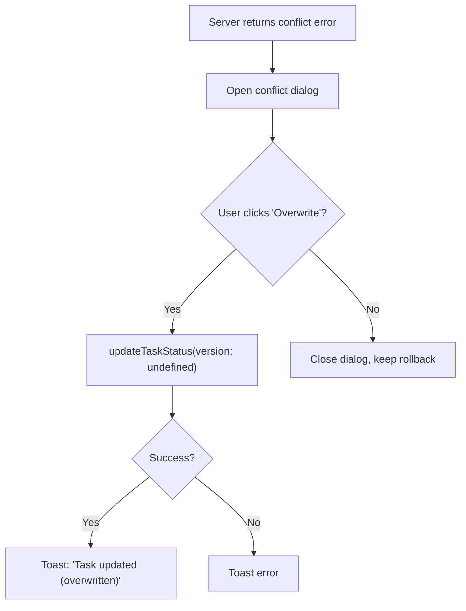

### Returns

| Property | Type | Description |
|----------|------|-------------|
| `board` | `Board` | Current board state (columns + tasks) |
| `activeColumn` | `Column \| null` | Column being dragged |
| `activeTask` | `Task \| null` | Task being dragged |
| `isAddColumnOpen` | `boolean` | Add column dialog state |
| `conflictModalOpen` | `boolean` | Conflict dialog state |
| `conflictTaskData` | `any` | Data for conflict resolution |
| `selectedTaskId` | `string \| null` | Currently selected task |
| `isConnected` | `boolean` | Socket connection status |
| `presence` | `PresenceUser[]` | Who is viewing the board |
| `editingTasks` | `Record<string, PresenceUser[]>` | Who is editing which task |
| `onDragStart` | `function` | dnd-kit drag start handler |
| `onDragOver` | `function` | dnd-kit drag over handler (optimistic) |
| `onDragEnd` | `function` | dnd-kit drag end handler (persist) |
| `handleRefresh` | `function` | Full page reload |
| `handleResolveConflict` | `function` | Force-overwrite on conflict |
| `handleUndo` | `function` | Undo last action |

---

## 4. Task Details Hook

**File:** `hooks/use-task/use-task-details.ts`

**Purpose:** Manages the task detail panel — fetching, updating, deleting tasks, and handling conflicts.

### Architecture

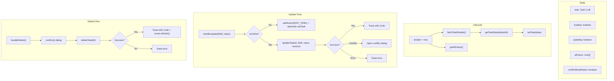

### Returns

| Property | Type | Description |
|----------|------|-------------|
| `task` | `Task \| null` | Current task data |
| `setTask` | `Dispatch<SetStateAction>` | Update task state |
| `loading` | `boolean` | Fetching task details |
| `updating` | `boolean` | Update in progress |
| `allUsers` | `User[]` | All users (for assignee dropdown) |
| `conflictModalOpen` | `boolean` | Conflict dialog state |
| `handleUpdate(field, value)` | `function` | Update a single field |
| `handleDelete()` | `function` | Delete the task |
| `handleResolveConflict()` | `function` | Force-overwrite on conflict |
| `fetchTaskDetails()` | `function` | Re-fetch from server |

---

## 5. Task Comments Hook

**File:** `hooks/use-task/use-task-comments.ts`

**Purpose:** Handles comments — add, edit, delete, and emoji reactions.

### Architecture

```mermaid
flowchart TD
    subgraph "State"
        NEW["newComment: string"]
    end

    subgraph "Add Comment"
        ADD["handleAddComment()"] --> ONLINE{"isOnline?"}
        ONLINE -->|No| QUEUE["addAction(ADD_COMMENT) + optimistic setTask"]
        ONLINE -->|Yes| API["addComment(taskId, content)"]
        API --> OK{"Success?"}
        OK -->|Yes| TOAST["Toast with Undo"]
        OK -->|No| ERR["Toast error"]
    end

    subgraph "Edit Comment"
        EDIT["handleEditComment(id, content)"] --> CHECK["isCommentEditable()"]
        CHECK --> AGE{"Age < 5 min OR admin/manager?"}
        AGE -->|Yes| API_EDIT["editComment(id, content)"]
        AGE -->|No| REJECT["Reject"]
    end

    subgraph "Delete Comment"
        DEL["handleDeleteComment(id)"] --> CONFIRM["confirm()"]
        CONFIRM --> API_DEL["deleteComment(id)"]
        API_DEL --> OK_DEL{"Success?"}
        OK_DEL -->|Yes| TOAST_DEL["Toast with Undo"]
    end

    subgraph "Reactions"
        REACT["handleToggleReaction(commentId, emoji)"] --> FIND{"Existing reaction?"}
        FIND -->|Yes| DEL_R["delete reaction"]
        FIND -->|No| ADD_R["create reaction"]
    end
```

### Comment Edit Window

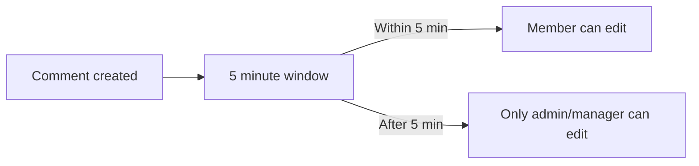

### Returns

| Property | Type | Description |
|----------|------|-------------|
| `newComment` | `string` | Comment input value |
| `setNewComment` | `function` | Set input value |
| `handleAddComment()` | `function` | Add a new comment |
| `handleDeleteComment(id)` | `function` | Delete a comment |
| `handleEditComment(id, content)` | `function` | Edit a comment |
| `handleToggleReaction(commentId, emoji)` | `function` | Toggle emoji reaction |
| `isCommentEditable(comment)` | `function` | Check if comment can be edited |

---

## 6. Task Checklist Hook

**File:** `hooks/use-task/use-task-checklist.ts`

**Purpose:** Full CRUD for checklists and checklist items.

### Architecture

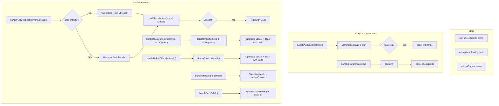

### Returns

| Property | Type | Description |
|----------|------|-------------|
| `newChecklistItem` | `string` | New item input value |
| `editingItemId` | `string \| null` | Currently editing item ID |
| `editingContent` | `string` | Edit input value |
| `handleAddChecklist(title?)` | `function` | Create checklist |
| `handleDeleteChecklist(id)` | `function` | Delete checklist |
| `handleAddChecklistItem(checklistId?)` | `function` | Add item (auto-creates checklist if none) |
| `handleToggleChecklistItem(id, isCompleted)` | `function` | Toggle checkbox |
| `handleDeleteChecklistItem(id)` | `function` | Delete item |
| `handleStartEdit(id, content)` | `function` | Start inline editing |
| `handleSaveEdit(id)` | `function` | Save edited item |

---

## 7. Task Attachments Hook

**File:** `hooks/use-task/use-task-attachments.ts`

**Purpose:** Upload and delete file attachments.

### Architecture

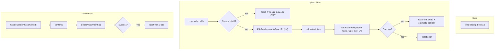

### Returns

| Property | Type | Description |
|----------|------|-------------|
| `isUploading` | `boolean` | Upload in progress |
| `handleUpload(event)` | `function` | Handle file input change |
| `handleDeleteAttachment(id)` | `function` | Delete attachment |

---

## 8. Task Tags Hook

**File:** `hooks/use-task/use-task-tags.ts`

**Purpose:** Add and remove tags from tasks. Fetches available board tags automatically.

### Architecture

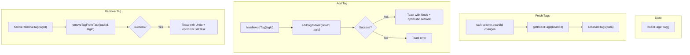

### Returns

| Property | Type | Description |
|----------|------|-------------|
| `boardTags` | `Tag[]` | All tags available on this board |
| `handleAddTag(tagId)` | `function` | Add tag to task |
| `handleRemoveTag(tagId)` | `function` | Remove tag from task |

---

## 9. Task Time Hook

**File:** `hooks/use-task/use-task-time.ts`

**Purpose:** Log, edit, and delete time entries. Duration stored in **minutes**.

### Architecture

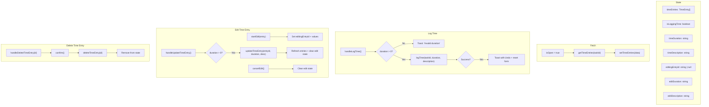

### Returns

| Property | Type | Description |
|----------|------|-------------|
| `timeEntries` | `TimeEntry[]` | All time entries for task |
| `isLoggingTime` | `boolean` | Log time form open |
| `timeDuration` | `string` | Duration input (minutes) |
| `timeDescription` | `string` | Description input |
| `isLoading` | `boolean` | Fetching entries |
| `editingEntryId` | `string \| null` | Currently editing entry |
| `editDuration` | `string` | Edit duration input |
| `editDescription` | `string` | Edit description input |
| `handleLogTime()` | `function` | Log new time entry |
| `startEdit(entry)` | `function` | Start editing entry |
| `cancelEdit()` | `function` | Cancel editing |
| `handleUpdateTimeEntry()` | `function` | Save edited entry |
| `handleDeleteTimeEntry(id)` | `function` | Delete time entry |
| `refreshTimeEntries()` | `function` | Re-fetch from server |

---

## 10. Task Reviews Hook

**File:** `hooks/use-task/use-task-reviews.ts`

**Purpose:** Submit tasks for review and complete reviews (approve/request changes/reject).

### Architecture

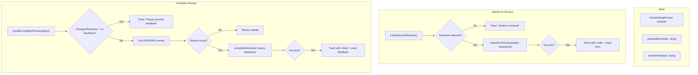

### Review Flow

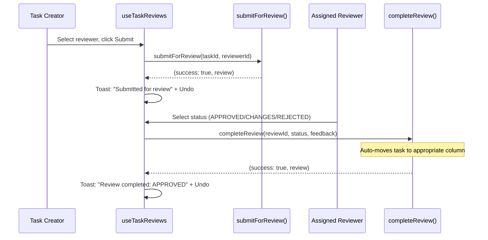

### Returns

| Property | Type | Description |
|----------|------|-------------|
| `isSubmittingReview` | `boolean` | Submit form open |
| `selectedReviewer` | `string` | Selected reviewer ID |
| `reviewFeedback` | `string` | Feedback text |
| `handleSubmitReview()` | `function` | Submit task for review |
| `handleCompleteReview(status)` | `function` | Complete review (APPROVED/CHANGES_REQUESTED/REJECTED) |

---

## 11. Task Activity Hook

**File:** `hooks/use-task/use-task-activity.ts`

**Purpose:** Displays the audit log for a task. Refreshes automatically on board events.

### Architecture

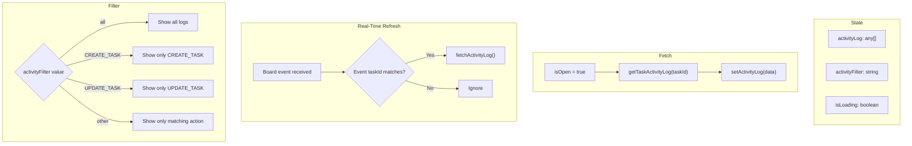

### Returns

| Property | Type | Description |
|----------|------|-------------|
| `activityLog` | `any[]` | All audit log entries for task |
| `filteredActivityLog` | `any[]` | Filtered by action type |
| `activityFilter` | `string` | Current filter value |
| `setActivityFilter` | `function` | Change filter |
| `isLoading` | `boolean` | Fetching logs |
| `refreshActivity()` | `function` | Re-fetch from server |

---

## 12. Mobile Hook

**File:** `hooks/use-mobile.ts`

**Purpose:** Detects if the viewport is below 768px (mobile breakpoint).

### Architecture

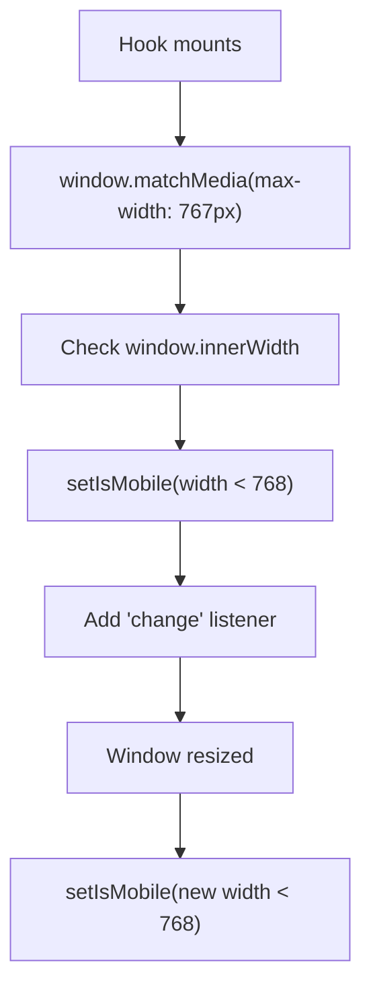

### Returns

| Property | Type | Description |
|----------|------|-------------|
| `useIsMobile()` | `boolean` | `true` if viewport < 768px |

---

## 13. Hook Dependency Graph

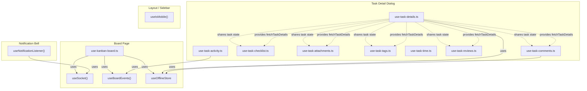

---

## 14. Common Patterns

### Pattern 1: Server Action + Optimistic Update + Undo

Every task sub-hook follows this pattern:

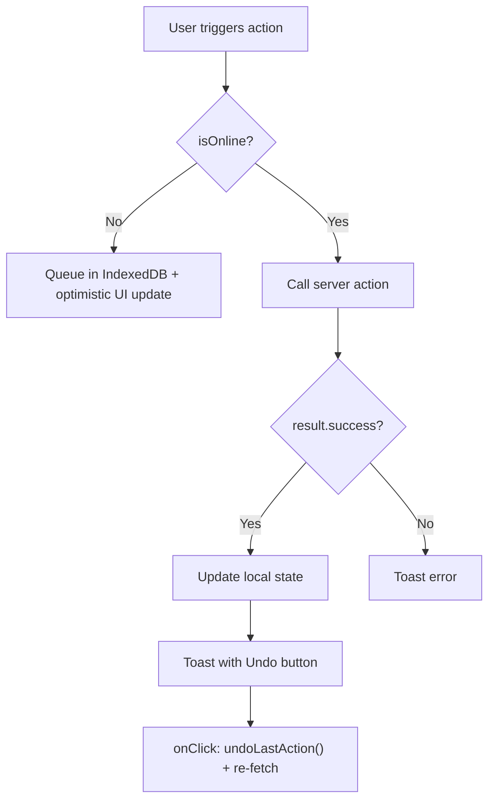

### Pattern 2: Fetch on Open

Task sub-hooks fetch their data when the detail dialog opens:

```mermaid
flowchart TD
    OPEN["isOpen = true"] --> CHECK{"taskId exists?"}
    CHECK -->|Yes| FETCH["Call server action"]
    FETCH --> SET["Set state with data"]
    CHECK -->|No| SKIP["Do nothing"]
```

### Pattern 3: Shared Task State

All task sub-hooks receive the same props:

```
{
  taskId: string | null
  task: Task | null
  setTask: Dispatch<SetStateAction<Task | null>>
  fetchTaskDetails: () => Promise<void>
  currentUser: User          (comments, reviews only)
}
```

This means they all operate on the **same task object** in memory. When one hook updates the task, all others see the change immediately.

### Pattern 4: Conflict Resolution

Hooks that modify tasks handle version conflicts:

```mermaid
flowchart TD
    UPDATE["updateTask(field, value, version)"] --> SERVER["Server checks version"]
    SERVER --> MATCH{"clientVersion === serverVersion?"}
    MATCH -->|Yes| OK["Update succeeds, version++"]
    MATCH -->|No| CONFLICT["Return conflict error"]
    CONFLICT --> DIALOG["Show conflict dialog"]
    DIALOG --> FORCE["updateTask(field, value, version: undefined)"]
    FORCE --> OK_FORCE["Force update, version++"]
```

### Pattern 5: Real-Time Refresh

The activity hook subscribes to board events to stay fresh:

```mermaid
flowchart TD
    HOOK["useTaskActivity mounts"] --> SUB["useBoardEvents(boardId, handler)"]
    SUB --> EVENT["Board event received"]
    EVENT --> MATCH{"Event taskId matches current task?"}
    MATCH -->|Yes| FETCH["fetchActivityLog()"]
    MATCH -->|No| IGNORE["No-op"]
```

---

## Quick Reference Table

| Hook | File | Lines | State Variables | Handlers | Offline Support |
|------|------|-------|-----------------|----------|-----------------|
| `useSocket` | `socket-hooks.ts` | 78 | 4 | 0 | No |
| `useBoardEvents` | `socket-hooks.ts` | 33 | 0 | 0 | No |
| `useNotificationListener` | `socket-hooks.ts` | 21 | 0 | 0 | No |
| `use-kanban-board` | `hooks/` | 457 | 7 | 6 | Yes |
| `use-task-details` | `hooks/use-task/` | 189 | 5 | 3 | Yes |
| `use-task-comments` | `hooks/use-task/` | 157 | 1 | 5 | Yes |
| `use-task-checklist` | `hooks/use-task/` | 275 | 3 | 7 | No |
| `use-task-attachments` | `hooks/use-task/` | 115 | 1 | 2 | No |
| `use-task-tags` | `hooks/use-task/` | 100 | 1 | 2 | No |
| `use-task-time` | `hooks/use-task/` | 153 | 7 | 5 | No |
| `use-task-reviews` | `hooks/use-task/` | 113 | 3 | 2 | No |
| `use-task-activity` | `hooks/use-task/` | 61 | 3 | 1 | No |
| `useIsMobile` | `hooks/` | 19 | 1 | 0 | No |
